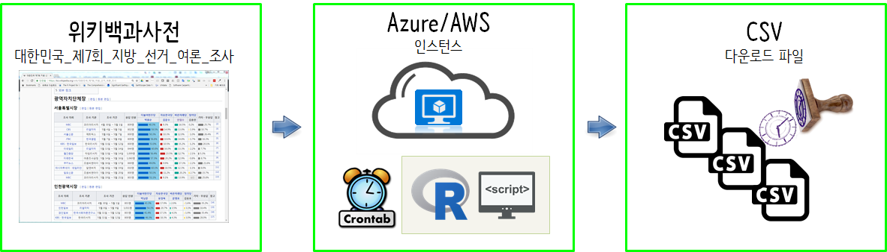

 
``` {r, include=FALSE}
source("tools/chunk-options.R")
knitr::opts_chunk$set(echo = TRUE, warning=FALSE, message=FALSE)
```

# 크롤링 자동화 [^south-africa-workshop] {#crawl-automation}

[^south-africa-workshop]: [Digital Age Economist(May 23, 2018), Workshop in Cape Town: Web Scraping with R](https://www.daeconomist.com/post/2018-05-23-workshop-web-scraping-cape-town/)

2018년 6월 13일 제7회 전국지방선거가 현재 시간 기준(`r Sys.Date()`) 19일 남아있다.
이에 따라서 대진표가 정해지고 시시각각 다양한 여론조사 기관에서 광역자치단체장에 대한 여론조사결과가 갱신되고 있다.
이를 매일 수작업으로 가져오는 것은 비현실적이라 Azure, AWS 클라우드 컴퓨터를 저렴하게 임대해서 
자동으로 데이터를 긁어올 수 있도록 크롤링 서버를 구축해본다.



# 크롤링 서버 {#crawl-automation-server}

## 크롤링 R 코드 {#crawl-automation-server-r}

먼저 [위키백과사전, 대한민국 제7회 지방 선거 여론 조사](https://ko.wikipedia.org/wiki/%EB%8C%80%ED%95%9C%EB%AF%BC%EA%B5%AD_%EC%A0%9C7%ED%9A%8C_%EC%A7%80%EB%B0%A9_%EC%84%A0%EA%B1%B0_%EC%97%AC%EB%A1%A0_%EC%A1%B0%EC%82%AC)
웹페이지에서 과역자치단체장 여론조사결과를 긁어오는 R 코드를 작성한다.

- [데이터 과학자가 바라본 제7회 지방선거 - 광역단체장 판세(2018-05-22)](http://statkclee.github.io/politics/sido-status-2018-05-22.html)

상기 웹사이트에서 작성된 R 코드를 바탕으로 크롤링 R스크립트를 작성한다.

파일명을 `crawl_local7_survey.R` 파일로 저장한다.

``` {r crawl-survey-code, eval = FALSE}
# crawl_local7_survey.R
library(tidyverse)
library(rvest)
library(lubridate)
library(glue)

# 1. 데이터 -----
## 1.1. 제 7 회 지방선거 여론조사 -----
seven_url <- "https://ko.wikipedia.org/wiki/대한민국_제7회_지방_선거_여론_조사"
sido_v <- c("서울특별시장","인천광역시장","경기도지사","강원도지사","대전광역시장","세종특별자치시장","충청남도지사","충청북도지사","광주광역시장","전라남도지사","전라북도지사","부산광역시장","대구광역시장","울산광역시장","경상남도지사","경상북도지사","제주특별자치도지사")

crawl_survey <- function(sido_index) {
  sido_df <- read_html(seven_url) %>%
    html_nodes("table") %>%
    .[[sido_index+1]] %>%
    html_table(fill=TRUE)

  sido_df <- sido_df %>%
    mutate_at(vars(contains("당")), funs(str_replace_all(., "%", ""))) %>%
    mutate_at(vars(contains("기타")), funs(str_replace_all(., "%", ""))) %>%
    mutate_at(vars(contains("응답")), funs(str_replace_all(., "명|,", "")))

  sido_df <- sido_df %>% filter(! row_number() %in% c(1)) %>%
    separate("조사 기간", into=c("시작일", "종료일"), sep="\\~") %>%
    separate(시작일, into=c("월", "일"), sep=" ") %>%
    mutate(월 = str_extract(월, "[0-9]+"),
            일 = str_extract(일, "[0-9]+"))  %>%
    mutate(조사일 = ymd(str_c("2018-", 월, "-", 일))) %>%
    select(-월, -일, -종료일) %>%
    mutate("시도명" = sido_v[sido_index])

  return(sido_df)
}

assign(sido_v[1], crawl_survey(1)) # 1.1    서울특별시장
assign(sido_v[2], crawl_survey(2)) # 1.2    인천광역시장
assign(sido_v[3], crawl_survey(3)) # 1.3    경기도지사
assign(sido_v[4], crawl_survey(4)) # 1.4    강원도지사
assign(sido_v[5], crawl_survey(5)) # 1.5    대전광역시장
assign(sido_v[6], crawl_survey(6)) # 1.6    세종특별자치시장
assign(sido_v[7], crawl_survey(7)) # 1.7    충청남도지사
assign(sido_v[8], crawl_survey(8)) # 1.8    충청북도지사
assign(sido_v[9], crawl_survey(9)) # 1.9    광주광역시장
assign(sido_v[10], crawl_survey(10)) # 1.10 전라남도지사
assign(sido_v[11], crawl_survey(11)) # 1.11 전라북도지사
assign(sido_v[12], crawl_survey(12)) # 1.12 부산광역시장
assign(sido_v[13], crawl_survey(13)) # 1.13 대구광역시장
assign(sido_v[14], crawl_survey(14)) # 1.14 울산광역시장
assign(sido_v[15], crawl_survey(15)) # 1.15 경상남도지사
assign(sido_v[16], crawl_survey(16)) # 1.16 경상북도지사
assign(sido_v[17], crawl_survey(17)) # 1.17 제주특별자치도지사

sido_list <-  mget(sido_v)
sido_survey_df <- map_df(sido_list, bind_rows)

## 1.2. Save Data -----
sido_survey_df %>% write_rds(glue("/home/rstudio/shiny/sido_survey_", format(Sys.Date(), "%Y-%m-%d"), ".rds"))
```

## 쉘스크립트 작성 {#crawl-automation-server-r-shell}

`crawl_local7_survey.R` 코드를 실행할 때, `/usr/bin/Rscript`를 사용하게 되면 
[대한민국 제7회 지방 선거 여론 조사](https://ko.wikipedia.org/wiki/%EB%8C%80%ED%95%9C%EB%AF%BC%EA%B5%AD_%EC%A0%9C7%ED%9A%8C_%EC%A7%80%EB%B0%A9_%EC%84%A0%EA%B1%B0_%EC%97%AC%EB%A1%A0_%EC%A1%B0%EC%82%AC)
웹페이지에서 광역자치단체장에 해당되는 여론조사결과만 추려 데이터프레임으로 변환하여 ` sido_survey_2018-05-25.rds` 같은 파일로 저장하게 된다.

이때 `crawl_local7_survey.sh` 배쉬 쉘스크립트 파일을 다음과 같이 작성한다.
아래 배쉬 쉘스크립트는 `crawl_local7_survey.R` 코드를 `Rscript` 프로그램으로 구동시키는 역할을 한다.

``` {r crawl-shell-script, eval=FALSE}
#!/bin/bash

/usr/bin/Rscript /home/rstudio/shiny/crawl_local7_survey.R
```

## 크론(cron) 등록 [^cron-register] {#crawl-automation-server-r-shell-cron}

[^cron-register]: [리눅스 크론탭(Linux Crontab) 사용법](http://jdm.kr/blog/2)

`sudo crontab -e` 명령어를 넣게 되면 특정 시간이 되면 자동으로 프로그램을 실행시킬 수가 있다.
이를 위해서 `* * * * * /home/rstudio/shiny/crawl_local7_survey.sh > /home/rstudio/shiny/crawl.sh.log 2>&1`와 같이 하여 
매 1분마다 코드를 자동실행시켜 정상적으로 동작하는지 파악하고 매 1분마다 정상적으로 데이터를 가져오는 것이 확인되면
`#`으로 주석처리하고 나서 `0 7 * * * /home/rstudio/shiny/crawl_local7_survey.sh`을 작성하여 매일 7시마다 일 1회 데이터를 가져오도록 한다.

``` {r crawl-shell-script-cron, eval=FALSE}
# * * * * * /home/rstudio/shiny/crawl_local7_survey.sh > /home/rstudio/shiny/crawl.sh.log 2>&1
0 7 * * * /home/rstudio/shiny/crawl_local7_survey.sh
```

## 크론작업 확인 {#crawl-automation-server-r-shell-cron-check}

크론탭(crontab)이 정해진 시간 실행이 되면 `sido_survey_2018-05-25.rds`, `crawl.sh.log` 파일이 생성된다.
그리고 제대로 실행이 되었는지는 크론을 실행시켜 남긴 로그 `cat crawl.sh.log`를 열어보고 정상적으로 동작이 된 것을 확인한다.

``` {r crawl-shell-script-cron-check, eval=FALSE}
ubuntu@ip-xxx-xx-xx-xxx:/home/rstudo/shiny$ ls -al
total 32
drwxrwxrwx 2 root   root    4096 May 25 07:47 .
drwxr-xr-x 5 root   root    4096 May 25 06:15 ..
-rw-r--r-- 1 ubuntu ubuntu  2812 May 25 06:20 crawl_local7_survey.R
-rwxrwxr-x 1 ubuntu ubuntu    76 May 25 07:29 crawl_local7_survey.sh
-rw-r--r-- 1 root   root    2887 May 25 07:51 crawl.sh.log
-rw-r--r-- 1 root   root   11717 May 25 07:51 sido_survey_2018-05-25.rds
ubuntu@ip-xxx-xx-xx-xxx:/home/rstudo/shiny$ cat crawl.sh.log
── Attaching packages ─────────────────────────────────────── tidyverse 1.2.1 ──
✔ ggplot2 2.2.1.9000     ✔ purrr   0.2.4
✔ tibble  1.4.2          ✔ dplyr   0.7.4
✔ tidyr   0.8.0          ✔ stringr 1.3.0
✔ readr   1.1.1          ✔ forcats 0.3.0
── Conflicts ────────────────────────────────────────── tidyverse_conflicts() ──
✖ dplyr::filter() masks stats::filter()
✖ dplyr::lag()    masks stats::lag()
Loading required package: xml2

Attaching package: ‘rvest’

The following object is masked from ‘package:purrr’:

    pluck

The following object is masked from ‘package:readr’:

    guess_encoding

Loading required package: methods

Attaching package: ‘lubridate’

The following object is masked from ‘package:base’:

    date
.....

```

