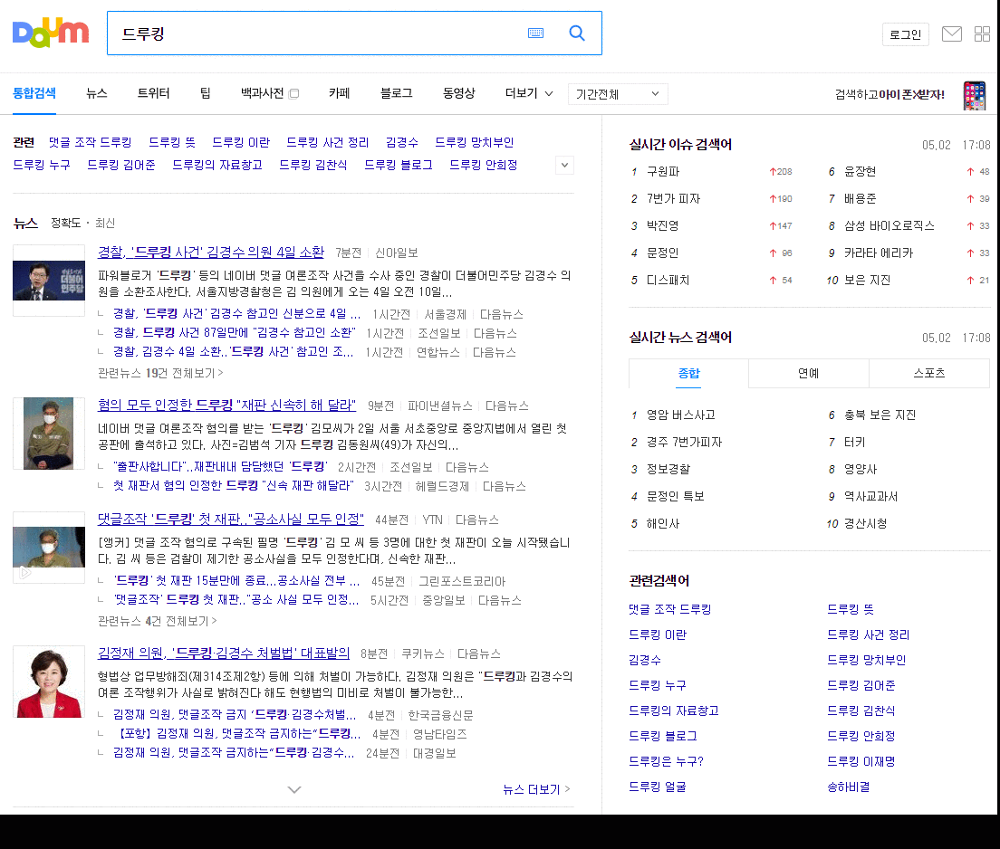

 
``` {r, include=FALSE}
source("tools/chunk-options.R")
knitr::opts_chunk$set(echo = TRUE, warning=FALSE, message=FALSE)
```


# 다음 연관검색어 {#daum-related-search}

다음 연관검색어는 네이버 연관검색어와 몇가지 면에서 차이가 난다. 
우선 네이버는 연관검색어가 10개로 고정된 반면, 다음은 연관검색어 숫자가 10개를 넘어가기도 하고 
특정 검색어는 연관검색어가 10개보다 작은 경우도 있다.



# 보고서 - 연관검색어 {#report-related-search}

다음 연관검색어를 보고서에 넣기 위해서 작업하는 과정을 상정한다.

## 다음 연관검색어 추출 {#daum-related-search-crawl}

다음 검색창에 "검색어"를 넣게 되면 반환되는 값을 찾아내어 이를 `xpath=` 방식으로 가져온다.
검색어를 넣었을 때, 첫번째 연관된 검색어 10개를 추출하여 이를 `R1` 벡터에 넣고,
`R1` 벡터 원소를 검색어로 넣어 검색결과를 `R2`에 넣는다.

그리고, 리스트로 연관검색어를 저장하고 `listviewer::jsonedit()` 함수로 긁어온 연관검색어를 살펴보자.

``` {r daum-related-search-crawl}
# 0. 환경설정 -----
library(glue)
library(tidyverse)
library(rvest)
library(urltools)
library(igraph)
library(networkD3)

# 1. 데이터 -----
## 1.1. 다음URL + 검색어
searchURL <- "https://search.daum.net/search?w=tot&DA=YZR&t__nil_searchbox=btn&sug=&sugo=&q="
keyword <- "드루킹"
    
## 1.2. 첫번째 검색어
R1 <- vector(mode="character", length = 0)

for(i in 1:10) {
    R1[i] <- glue(searchURL, keyword) %>%
        read_html %>%
        html_nodes(xpath = glue('//*[@id="netizen_lists_top"]/span[', i, ']')) %>%
        html_text
}

## 1.3. 두번째 검색어
R2 <- vector(mode="list", length = 0)

for(i in 1:10) {
    R_tmp <- vector(mode="character", length = 0)
    
    for(j in 1:10) {
        tryCatch({
            R_tmp[j] <- glue(searchURL, url_encode(R1[i])) %>%
                read_html %>%
                html_nodes(xpath = glue('//*[@id="netizen_lists_top"]/span[', j, ']')) %>%
                html_text
        }, error = function(e) {})
    }
    R2[[i]] <- R_tmp %>% as.list
}

## 1.4. 첫번째 두번째 검색어 결합
R1 <- map_chr(R1, str_replace_all, "\\+", " ")
names(R2) <- R1

## 1.5. 데이터 저장 
listviewer::jsonedit(R2)
```

## 데이터프레임 변환 {#convert-to-dataframe}

연관검색어 상위권에 속하지만, 연관검색어가 10개가 되지 않는 경우가 있어 이를 방지하고자 
연관검색어가 10가 되지 않는 것은 과감히 제거한다. 그래야 1개 정도 연관검색어가 삭제된다.
이를 네트워크 시각화가 가능한 데이터프레임으로 변환시킨다.

``` {r daum-list-to-dataframe}
## 1.2. 리스트 --> 데이터프레임
### 리스트 정리,
R2 <- map(R2, ~ purrr::compact(.)) %>% 
    purrr::keep(~length(.) == 10)

### R1 & R2
R1R2_df <- map_dfc(R2, enframe, name="R2") %>% 
    unnest()  %>% 
    select(contains("value"))

colnames(R1R2_df) <- names(R2)

R1R2_df <- R1R2_df %>% 
    gather(key="from", value="to")

### R0 & R1
R0R1_df <- R1R2_df %>% count(from) %>% 
    rename(to = from,
           from = n) %>% 
    select(from, to) %>% 
    mutate(from = "드루킹")

### R0 & R1 & R2
daum_df <- bind_rows(R0R1_df, R1R2_df)

DT::datatable(daum_df)
```

## 연관검색어 시각화 {#visualize-dataframe}

연관검색어를 `networkD3` 자료구조로 변환시킨다. 그리고 나서, 
연관검색어 그룹 지정을 하고 `forceNetwork()` 함수로 시각화한다.

``` {r daum-list-to-dataframe-viz}
# 2. 시각화 -----
## 2.1. 검색어 그룹 지정 
pre <- daum_df %>%
    graph_from_data_frame %>%
    igraph_to_networkD3

pre$nodes$group <- ifelse(pre$nodes$name %in% R0R1_df$from, "Keyword",
                          ifelse(pre$nodes$name %in% R0R1_df$to, "1st Relation", "2nd Relation"))

## 2.2. 네트워크 시각화 ----
networkD3::forceNetwork(Links = pre$links, Nodes = pre$nodes,
                         colourScale = JS("d3.scaleOrdinal(d3.schemeCategory10);"),
                         Source = "source", Target = "target",
                         Group = "group", NodeID = "name",
                         opacity = 0.7, zoom = T,
                         fontSize = 13, fontFamily = "NanumGothic", legend = T,
                         opacityNoHover = 0.9)
```

# 함수 - 연관검색어 {#report-related-search}

자동화를 위해서 함수형태로 검색어를 넣으면 연관검색어가 도출되고 이를 시각화하도록 개발해보자.

## 연관검색어 추출 함수 {#daum-related-search-crawl-function}

`daum_crawl_search_terms("드루킹")`와 같은 형태로 "드루킹" 검색어를 넣을 경우 이와 연관된 검색어가
리스트 형태로 반환되도록 작업한다.

``` {r daum-related-search-term-function}
## 0.1. 다음 연관검색어 -----
daum_crawl_search_terms <- function(keyword) {
    # 1. 데이터 -----
    ## 1.1. 다음URL + 검색어
    searchURL <- "https://search.daum.net/search?w=tot&DA=YZR&t__nil_searchbox=btn&sug=&sugo=&q="

    ## 1.2. 첫번째 검색어
    R1 <- vector(mode="character", length = 0)
    
    for(i in 1:10) {
        tryCatch({
            R1[i] <- glue(searchURL, keyword) %>%
                read_html %>%
                html_nodes(xpath = glue('//*[@id="netizen_lists_top"]/span[', i, ']')) %>%
                html_text
        }, error = function(e) {})
    }
    
    ## 1.3. 두번째 검색어
    R2 <- vector(mode="list", length = 0)

    for(i in 1:10) {
        R_tmp <- vector(mode="character", length = 0)
        
        for(j in 1:10) {
            tryCatch({
                R_tmp[j] <- glue(searchURL, url_encode(R1[i])) %>%
                    read_html %>%
                    html_nodes(xpath = glue('//*[@id="netizen_lists_top"]/span[', j, ']')) %>%
                    html_text
            }, error = function(e) {})
        }
        R2[[i]] <- R_tmp %>% as.list
    }
    
    ## 1.4. 첫번째 두번째 검색어 결합
    names(R2) <- R1
    
    ## 1.5. 데이터 반환 저장 
    return(R2)
}
druking_list <- daum_crawl_search_terms("드루킹")

listviewer::jsonedit(druking_list)
```


## 데이터프레임 변환 함수 {#daum-related-search-df-function}

`daum_list2df(druking_list, "드루킹")`와 같은 형태로 리스트(`druking_list`)를 넣을 경우,
데이터프레임으로 반환하는 함수를 작성한다.

``` {r daum-related-search-term-df-function}
## 0.2. 리스트를 데이터프레임 변환 -----
daum_list2df <- function(input_list, keyword) {
    
    # NULL 원소 제거 ----
    input_cl_list <- map(input_list, ~ purrr::compact(.)) %>% 
        purrr::keep(~length(.) == 10)
    
    ## 1.2. 리스트 --> 데이터프레임
    ### R1 & R2
    R1R2_df <- map_dfc(input_cl_list, enframe, name="R2") %>% 
        unnest()  %>% 
        select(contains("value"))
    
    colnames(R1R2_df) <- names(input_cl_list)
    
    R1R2_df <- R1R2_df %>% 
        gather(key="from", value="to")
    
    ### R0 & R1
    R0R1_df <- R1R2_df %>% count(from) %>% 
        rename(to = from,
               from = n) %>% 
        select(from, to) %>% 
        mutate(from = keyword)
    
    ### R0 & R1 & R2
    list2df_df <- bind_rows(R0R1_df, R1R2_df)
    
    daum_list <- list(R0R1_df, list2df_df)
    
    return(daum_list)
}

daum_list2df(druking_list, "드루킹") %>% head
```

## 네트워크 시각화 {#daum-related-search-network-function}

`daum_related_search("드루킹")`와 같이 검색어를 넣으면 네트워크 시각화를 하는 함수를 작성한다.
앞서 작성한 `daum_crawl_search_terms()` 함수가 검색어를 넣으면 리스트 형태 연관검색어를 가져왔다면,
`daum_list2df()` 함수는 리스트를 입력받아 이를 데이터프레임 형태로 반환한다.
이후, `networkD3::forceNetwork()` 함수를 통해 네트워크 시각화를 한다.

``` {r daum-related-search-term-nw-function}
# 1. 다음 연관검색어 -----
daum_related_search <- function(keyword){
    
    # 연관검색어
    daum_keyword_list <- daum_crawl_search_terms(keyword)
    # 리스트를 데이터프레임 변환
    daum_list <- do.call(what="daum_list2df", alist(input_list=daum_keyword_list, keyword=keyword)) 
    # 네트워크 시각화
    ## 검색어 그룹 지정 
    pre <- daum_list[[2]] %>%
        graph_from_data_frame %>%
        igraph_to_networkD3
    
    pre$nodes$group <- ifelse(pre$nodes$name %in% daum_list[[1]]$from, "Keyword",
                              ifelse(pre$nodes$name %in% daum_list[[1]]$to, "1st Relation", "2nd Relation"))
    
    ## 네트워크 시각화 ----
    networkD3::forceNetwork(Links = pre$links, Nodes = pre$nodes,
                            colourScale = JS("d3.scaleOrdinal(d3.schemeCategory10);"),
                            Source = "source", Target = "target",
                            Group = "group", NodeID = "name",
                            opacity = 0.7, zoom = T,
                            fontSize = 13, fontFamily = "NanumGothic", legend = T,
                            opacityNoHover = 0.9)
}

daum_related_search("드루킹")
```


