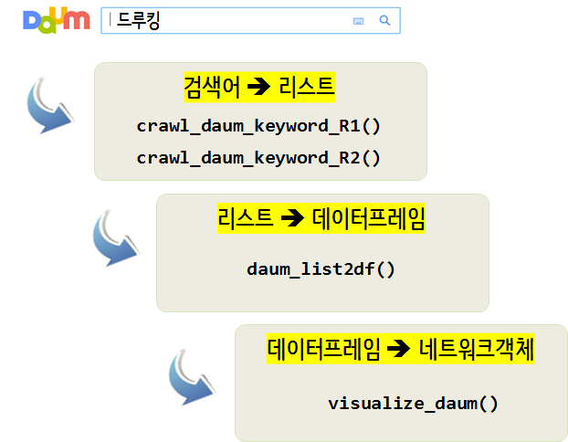

 
``` {r, include=FALSE}
source("tools/chunk-options.R")
knitr::opts_chunk$set(echo = TRUE, warning=FALSE, message=FALSE)
```


# 다음 연관검색어 {#daum-related-search}

다음 연관검색어는 네이버 연관검색어와 몇가지 면에서 차이가 난다. 
우선 네이버는 연관검색어가 10개로 고정된 반면, 다음은 연관검색어 숫자가 10개를 넘어가기도 하고 
특정 검색어는 연관검색어가 10개보다 작은 경우도 있다.


# 보고서 - 연관검색어 {#report-related-search}

다음 연관검색어를 보고서에 넣기 위해서 작업하는 과정을 상정한다.

## 다음 연관검색어 추출 {#daum-related-search-crawl}

다음 검색창에 "검색어"를 넣게 되면 반환되는 값을 찾아내어 이를 `xpath=` 방식으로 가져온다.
검색어를 넣었을 때, 첫번째 연관된 검색어 10개를 추출하여 이를 `R1` 벡터에 넣고,
`R1` 벡터 원소를 검색어로 넣어 검색결과를 `R2`에 넣는다. 
그리고, 리스트로 연관검색어를 저장하고 `listviewer::jsonedit()` 함수로 긁어온 연관검색어를 살펴보자.

상기 알고리즘 대신에 다음 연관검색어를 받아오는 로직을 변경하여 연관검색어 갯수에 상관없이 
적은 적은대로, 많은며 많은대로 연관검색어를 받아내어 `R1`에 저장하도록한다. 

``` {r daum-related-search-crawl}
# 0. 환경설정 -----
library(glue)
library(tidyverse)
library(rvest)
library(urltools)
library(igraph)
library(networkD3)
library(tidygraph)
library(ggraph)


# 1. 데이터 -----
## 1.1. 다음URL + 검색어
searchURL <- "https://search.daum.net/search?w=tot&DA=YZR&t__nil_searchbox=btn&sug=&sugo=&q="
keyword <- "드루킹"
    
## 1.2. 첫번째 검색어
R1 <- vector(mode="character", length = 0)

R1_idx_v <- 1L

while(TRUE) {
    keyword_res <- glue(searchURL, keyword) %>%
        read_html %>%
        html_nodes(xpath = glue('//*[@id="netizen_lists_top"]/span[', R1_idx_v, ']')) %>%
        html_text
    if(identical(keyword_res, character(0))) {
        break
    } else {
        R1[R1_idx_v] <- keyword_res
        R1_idx_v <- R1_idx_v + 1
    }
}

R1
```

## 다음 연관검색어 함수화 {#daum-related-search-crawl-function}

기능이 제대로 동작되는 것을 확인하였다면 다음 단계로 이를 함수로 만들어 동일한지 확인한다.

``` {r daum-crawl-R1-function}
## 1.3. 다음 검색어 함수

crawl_daum_keyword <- function(keyword) {
    
    R1 <- vector(mode="character", length = 0)
    
    R1_idx_v <- 1L
    
    while(TRUE) {
        keyword_res <- glue(searchURL, keyword) %>%
            read_html %>%
            html_nodes(xpath = glue('//*[@id="netizen_lists_top"]/span[', R1_idx_v, ']')) %>%
            html_text
        if(identical(keyword_res, character(0))) {
            break
        } else {
            R1[R1_idx_v] <- keyword_res
            R1_idx_v <- R1_idx_v + 1
        }
    }
    
    return(R1)
}

(R1 <- crawl_daum_keyword("드루킹"))
```

## 다음 연관검색어의 연관검색어 {#daum-related-search-crawl-function-R2}

검색어를 넣어 연관검색어가 도출되면 각 연관검색어를 검색어로 넣어 이에 대한 연관검색어를 뽑아낸다.
그리고 봅아낸 연관검색어를 `listviewer` 팩키지를 `jsonedit()` 함수로 제대로 추출되었는지 시각화한다.

``` {r daum-crawl-R2-function}
## 1.4. 두번째 검색어 함수 -----
R2 <- vector(mode="list", length = 0)

for(i in 1: length(R1)) {
    R2[[i]] <- crawl_daum_keyword(url_encode(R1[i]))
}

names(R2) <- R1

listviewer::jsonedit(R2)
```

## 데이터프레임 변환 {#convert-to-dataframe}

연관검색어 상위권에 속하지만, 연관검색어가 10개가 되지 않는 경우가 있어 이를 방지하고자 
연관검색어가 10가 되지 않는 것은 과감히 제거한다. 
이와 같은 방식 대신에... 다음 연관검색어로 가져온 모든 연관검색어 리스트 자료형을 
데이터프레임으로 변환시킨다. 목적은 네트워크 시각화가 가능한 데이터프레임으로 변환시키는 것이다.

`qdapTools` 팩키지 `list2df()` 함수를 사용하게 되면 리스트를 데이터프레임으로 쉽게 변환시킬 수 있다.
그리고 다음 후속공정에서 네트워크 시각화 그룹 지정을 위한 데이터프레임도 함께 준비한다.

``` {r daum-list-to-dataframe}
daum_list2df <- function(input_list, keyword) {
    
    R1R2_df <- qdapTools::list2df(input_list) %>% 
        rename(from=X2, to=X1) %>% 
        select(from, to)
        
    R0R1_df <- tibble(to = names(input_list)) %>% 
        mutate(from = keyword)
    
    daum_df <- bind_rows(R0R1_df, R1R2_df)
    daum_df_list <- list(R0R1_df, daum_df)
    
    return(daum_df_list)
}

daum_df_list <- daum_list2df(R2, "드루킹")

listviewer::jsonedit(daum_df_list)
```

## 연관검색어 시각화 {#visualize-dataframe}

연관검색어를 `networkD3` 자료구조로 변환시킨다. 그리고 나서, 
연관검색어 그룹 지정을 하고 `forceNetwork()` 함수로 시각화한다.

``` {r daum-list-to-dataframe-viz}
# 2. 시각화 -----
## 2.1. 검색어 그룹 지정 
pre <- daum_df_list[[2]] %>%
    graph_from_data_frame %>%
    igraph_to_networkD3

pre$nodes$group <- ifelse(pre$nodes$name %in% daum_df_list[[1]]$from, "Keyword",
                          ifelse(pre$nodes$name %in% daum_df_list[[1]]$to, "1st Relation", "2nd Relation"))

## 2.2. 네트워크 시각화 ----
networkD3::forceNetwork(Links = pre$links, Nodes = pre$nodes,
                        colourScale = JS("d3.scaleOrdinal(d3.schemeCategory10);"),
                        Source = "source", Target = "target",
                        Group = "group", NodeID = "name",
                        opacity = 0.7, zoom = T,
                        fontSize = 13, fontFamily = "NanumGothic", legend = T,
                        opacityNoHover = 0.9)
```


# 함수 - 연관검색어 {#report-related-search}

자동화를 위해서 함수형태로 검색어를 넣으면 연관검색어가 도출되고 이를 시각화하도록 개발해보자.
이를 위해서 검색어 키워드를 받아 이를 네트워크 객체로 변환시키기 위한 일련의 과정을 함수로 구현한다.

- 검색 키워드
    - `crawl_daum_keyword_R1()`: 키워드에서 1차 연관검색어를 도출
    - `crawl_daum_keyword_R2()`: 1차 연관검색어를 바탕으로 2차 연관검색어를 도출
- `daum_list2df()`: 리스트를 데이터프레임으로 변환
- `visualize_daum()`: 데이터프레임으로 네트워크 객체로 시각화



## 연관검색어 추출 함수 - R1 {#daum-related-search-crawl-function}

`crawl_daum_keyword_R1("드루킹")`와 같은 형태로 "드루킹" 검색어를 넣을 경우 이와 연관된 검색어가
리스트 형태로 반환되도록 작업한다.

``` {r daum-related-search-term-function-R1}
# 1. 다음 연관검색어 -----
## 검색어 --> 연관검색어 함수 ----
crawl_daum_keyword_R1 <- function(keyword) {
    
    searchURL <- "https://search.daum.net/search?w=tot&DA=YZR&t__nil_searchbox=btn&sug=&sugo=&q="
    
    R1 <- vector(mode="character", length = 0)
    
    R1_idx_v <- 1L
    
    while(TRUE) {
        keyword_res <- glue(searchURL, keyword) %>%
            read_html %>%
            html_nodes(xpath = glue('//*[@id="netizen_lists_top"]/span[', R1_idx_v, ']')) %>%
            html_text
        if(identical(keyword_res, character(0))) {
            break
        } else {
            R1[R1_idx_v] <- keyword_res
            R1_idx_v <- R1_idx_v + 1
        }
    }
    
    return(R1)
}

#(R1 <- crawl_daum_keyword_R1("드루킹"))
```

## 연관검색어 추출 함수 - R2 {#daum-related-search-crawl-function-R2}

`crawl_daum_keyword_R2()` 함수는 `crawl_daum_keyword_R1()` 함수를 호출하여 검색어를 바탕으로 
1차 연관검색어를 추출하고, 이를 바탕으로 2차 연관검색어를 추출한다.

``` {r daum-related-search-term-function-R2}
## 1.4. 두번째 검색어 함수 -----
crawl_daum_keyword_R2 <- function(keyword) {
    
    R1 <- crawl_daum_keyword_R1(keyword)
    
    R2 <- vector(mode="list", length = 0)
    
    for(i in 1: length(R1)) {
        R2[[i]] <- crawl_daum_keyword_R1(url_encode(R1[i]))
    }
    
    names(R2) <- R1
    
    return(R2)
}

#druking_list <- crawl_daum_keyword_R2("드루킹")
#listviewer::jsonedit(druking_list)
```

## 데이터프레임 변환 함수 {#daum-related-search-df-function}

`daum_list2df(druking_list, "드루킹")`와 같은 형태로 리스트(`druking_list`)를 넣을 경우,
데이터프레임으로 반환하는 함수를 작성한다.

``` {r daum-related-search-term-df-function}
## 0.2. 리스트를 데이터프레임 변환 -----
daum_list2df <- function(input_list, keyword) {
    
    R1R2_df <- qdapTools::list2df(input_list) %>% 
        rename(from=X2, to=X1) %>% 
        select(from, to)
        
    R0R1_df <- tibble(to = names(input_list)) %>% 
        mutate(from = keyword)
    
    daum_df <- bind_rows(R0R1_df, R1R2_df)
    daum_df_list <- list(R0R1_df, daum_df)
    
    return(daum_df_list)
}
```

## 네트워크 시각화 {#daum-related-search-network-function}

`visualize_daum("드루킹")`와 같이 검색어를 넣으면 네트워크 시각화를 하는 함수를 작성한다.
앞서 작성한 `crawl_daum_keyword_R2()` 함수가 검색어를 넣으면 리스트 형태 연관검색어를 가져왔다면,
`daum_list2df()` 함수는 리스트를 입력받아 이를 데이터프레임 형태로 반환한다.
이후, `networkD3::forceNetwork()` 함수를 통해 네트워크 시각화를 한다.

``` {r daum-related-search-term-nw-function}
visualize_daum <- function(keyword) {
    
    tmp_list <- crawl_daum_keyword_R2(keyword)
    
    daum_df_list <- daum_list2df(tmp_list, keyword)
    
    # 3. 시각화 ------
    ## 3.1. 데이터프레임 --> 네트워크 객체 ----
    pre <- daum_df_list[[2]] %>%
        graph_from_data_frame %>%
        igraph_to_networkD3
    ## 3.2. 시각화 그룹 지정 ----
    pre$nodes$group <- ifelse(pre$nodes$name %in% daum_df_list[[1]]$from, "Keyword",
                              ifelse(pre$nodes$name %in% daum_df_list[[1]]$to, "1st Relation", "2nd Relation"))
    
    ## 3.3. 네트워크 시각화 ----
    networkD3::forceNetwork(Links = pre$links, Nodes = pre$nodes,
                            colourScale = JS("d3.scaleOrdinal(d3.schemeCategory10);"),
                            Source = "source", Target = "target",
                            Group = "group", NodeID = "name",
                            opacity = 0.7, zoom = T,
                            fontSize = 13, fontFamily = "NanumGothic", legend = T,
                            opacityNoHover = 0.9)
    
}

visualize_daum("드루킹")
```


