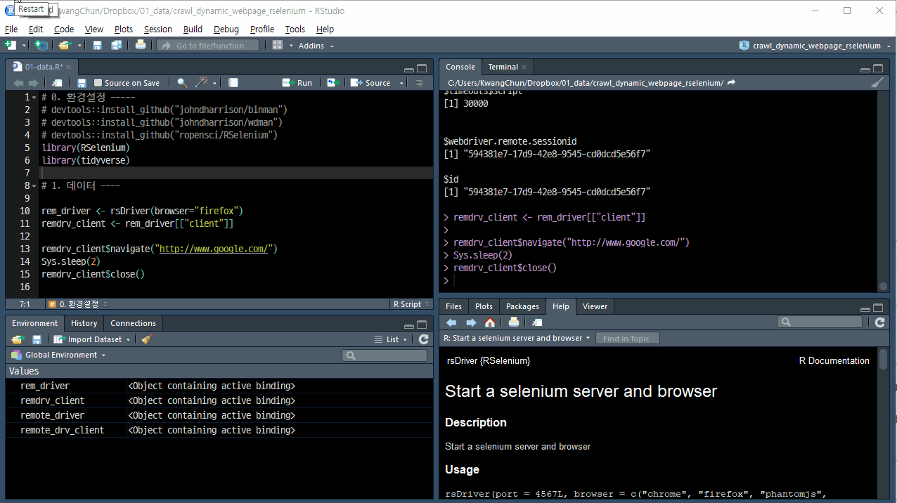
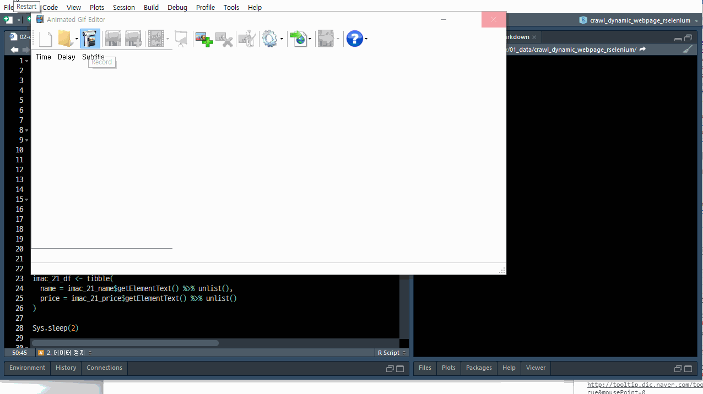

 
``` {r, include=FALSE}
source("tools/chunk-options.R")
knitr::opts_chunk$set(echo = TRUE, warning=FALSE, message=FALSE)
```

# `RSelenium` 설치 [^github-rselenium-install] {#install-RSelenium}

[^github-rselenium-install]: [ropensci/RSelenium, RSelenium removed from CRAN #172](https://github.com/ropensci/RSelenium/issues/172)

`RSelenium`이 `install.packages()` 명령어를 통해서 CRAN에서 다운로드를 할 수는 없다.
아마도 [CRAN, RSelenium](https://cran.r-project.org/src/contrib/Archive/RSelenium/) 에서 다운로드 받아 설치가 가능하지만,
최근에 [GitHub](https://github.com/ropensci/RSelenium)에 새로운 둥지를 틀었다.

`binman`, `wdman` 의존성이 있어 이를 설치하면 [RSelenium](https://github.com/ropensci/RSelenium)을 설치할 수 있다.

``` {r install-RSelenium, eval = FALSE} 
devtools::install_github("johndharrison/binman")
devtools::install_github("johndharrison/wdman")
devtools::install_github("ropensci/RSelenium")
```

# `RSelenium` 헬로월드 {#install-RSelenium-helloworld}

설치가 되었다면 간단히 헬로 월드 프로그램을 작성해서 정상 작동이 되는지 확인해보자.
웹브라우저로 `firefox`를 지정하고 나서 <http://www.google.com/> 웹사이트를 방문한 후에 2초가 살펴보고 
파이어폭스 웹브라우저를 닫는다.

``` {r RSelenium-helloworld, eval=FALSE}
# 0. 환경설정 -----
# devtools::install_github("johndharrison/binman")
# devtools::install_github("johndharrison/wdman")
# devtools::install_github("ropensci/RSelenium")
library(RSelenium)
library(tidyverse)

# 1. 데이터 ----
rem_driver <- rsDriver(browser="firefox")
remdrv_client <- rem_driver[["client"]]

remdrv_client$navigate("http://www.google.com/")
Sys.sleep(2)
remdrv_client$close()
```



# 애플 iMac 사이트 {#install-RSelenium-imac}

[iMac 27형](https://www.apple.com/kr-k12/shop/buy-mac/imac/27%ED%98%95), 
[iMac 21.5형](https://www.apple.com/kr-k12/shop/buy-mac/imac/21.5%ED%98%95) 두가지 크기를 갖는 iMac 웹사이트에서 
가격정보를 긁어오자.

웹사이트 중간에 "새 iMac을 구입해볼까요?" 라는 것과 함께 `21.5형`, `27형` 둘 중에 하나를 선택해야 세부 사향으로 들어갈 수 있다.
이를 위해서 `findElement()` 함수로 `xpath`를 가지고 클릭을 한 후에 변경된 웹페이지를 가져온다.

이후, 데이터프레임으로 변환을 하여 후속 작업을 위해 결합한다.

```{r rselenium-imac-price, eval=FALSE}
# 1. 데이터 ----
## 1.1. 애플 사이트 방문 -----
rem_driver <- rsDriver(browser="chrome")
remdrv_client <- rem_driver[["client"]]

remdrv_client$navigate("https://www.apple.com/kr-k12/shop/buy-mac/imac/21.5%ED%98%95")

## 1.2. 21.5인치 -----
imac_21_web_eleml <- remdrv_client$findElement("css selector", ".as-filter-button")
imac_21_web_eleml$clickElement()

imac_21_name <- remdrv_client$findElement("xpath", '//*[@id="model-selection"]/bundle-selection/div[3]/div[1]/div[2]/div/div[1]/div/bundle-selector/div[3]/div/div/h3')

imac_21_price <- remdrv_client$findElement("xpath", '//*[@id="model-selection"]/bundle-selection/div[3]/div[1]/div[2]/div/div[1]/div/bundle-selector/div[3]/div/div/div[2]/span[1]/span')

imac_21_df <- tibble(
  name = imac_21_name$getElementText() %>% unlist(),
  price = imac_21_price$getElementText() %>% unlist()
)

Sys.sleep(1)

## 1.3. 27인치 -----
imac_27_web_eleml <- remdrv_client$findElement("xpath", '//*[@id="model-selection"]/bundle-selection/div[2]/sticky/div/fieldset/div/span/button[2]')
imac_27_web_eleml$clickElement()

Sys.sleep(1)

imac_27_name <- remdrv_client$findElement("xpath", '//*[@id="model-selection"]/bundle-selection/div[3]/div[2]/div[2]/div/div[2]/div/bundle-selector/div[3]/div/div/h3')
imac_27_price <- remdrv_client$findElement("xpath", '//*[@id="model-selection"]/bundle-selection/div[3]/div[2]/div[2]/div/div[2]/div/bundle-selector/div[3]/div/div/div[2]/span[1]/span')

imac_27_df <- tibble(
  name = imac_27_name$getElementText() %>% unlist(),
  price = imac_27_price$getElementText() %>% unlist()
)

remdrv_client$close()

# 2. 데이터 정제 -----
imac_df <- bind_rows(imac_21_df, imac_27_df)
imac_df
```



# 유투뷰 동영상 {#rselenium-youtube}

|Using RSelenium to Download Google Trends Data(2016-02-06) | Web Scraping using RSelenium n SHINY(2015-12-07)|
|------------------------------|------------------------------|
| <iframe width="300" height="180" src="https://www.youtube.com/embed/qUKEPurS6-s" frameborder="0" allow="autoplay; encrypted-media" allowfullscreen></iframe> | <iframe width="300" height="180" src="https://www.youtube.com/embed/hDXY6Tco2JU" frameborder="0" allow="autoplay; encrypted-media" allowfullscreen></iframe> |


