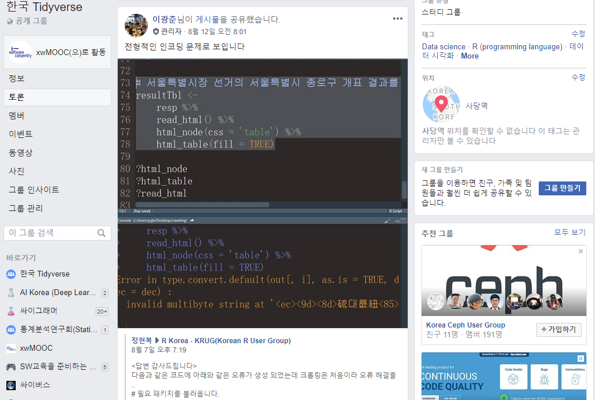

 
``` {r, include=FALSE}
source("tools/chunk-options.R")
knitr::opts_chunk$set(echo = TRUE, message=FALSE, warning=FALSE,
                      comment="", digits = 3, tidy = FALSE, prompt = TRUE, fig.align = 'center')

```

# 한국 Tidyverse 공유게시물 {#korea-tidyverse-post}

[한국 Tidyverse](https://www.facebook.com/groups/1404219106509417/) 선관위 데이터를 웹크롤링할 때 문제가 생겨 글이 올라온 적이 있습니다.
전형적인 인코딩 문제로 데이터를 크롤링하는 방법에 대해서 살펴 보기로 합니다.



# `POST` 웹크롤링 {#korea-tidyverse-post-webcrawl}

정적 웹데이터가 아니라 클릭을 해야만 원하는 데이터를 얻을 수 있기 때문에 `POST()` 함수를 통해서 
원하는 데이터를 넘겨 이를 정적웹페이지에서 표를 추출하는 방식으로 코딩을 합니다.


``` {r tidyverse-korea-post}
# 0. 환경설정 -----
library(tidyverse)
library(rvest)
library(httr)

# 1. 데이터 받아오기 -----
## 1.1 POST() 함수를 사용하여 시도지사선거의 서울특별시 종로구 개표 결과를 수집합니다.
resp <- POST(
    url = 'http://info.nec.go.kr/electioninfo/electionInfo_report.xhtml',
    encode = 'form', 
    body = list(
      electionId = '0020180613',
      electionCode = '3',
      requestURI = '/WEB-INF/jsp/electioninfo/0020180613/vc/vccp08.jsp',
      topMenuId = 'VC',
      secondMenuId = 'VCCP08',
      menuId = 'VCCP08',
      statementId = 'VCCP08_#00',
      statementId = '0020180613.VCCP08_#00',
      hubo1 = '박원순',
      hubo2 = '김문수',
      hubo3 = '안철수',
      hubo4 = '김종민',
      hubo5 = '김진숙',
      hubo6 = '인지연',
      hubo7 = '신지예',
      hubo8 = '우인철',
      hubo9 = '최태현',
      hubo10 = '',
      hubo11 = '',
      hubo12 = '',
      hubo13 = '',
      hubo14 = '',
      hubo15 = '',
      hubo16 = '',
      hubo17 = '',
      hubo18 = '',
      hubo19 = '',
      hubo20 = '',
      jd1 = '더불어민주당',
      jd2 = '자유한국당',
      jd3 = '바른미래당',
      jd4 = '정의당',
      jd5 = '민중당',
      jd6 = '대한애국당',
      jd7 = '녹색당',
      jd8 = '우리미래',
      jd9 = '친박연대',
      jd10 = '',
      jd11 = '',
      jd12 = '',
      jd13 = '',
      jd14 = '',
      jd15 = '',
      jd16 = '',
      jd17 = '',
      jd18 = '',
      jd19 = '',
      jd20 = '',
      wiwName = '중구', 
      cityCode = '1100',
      townCode = '1102'
    )
  )

Sys.setlocale("LC_ALL", "C")

## 1.2.서울특별시장 선거의 서울특별시 종로구 개표 결과를 추출합니다.
vote_dat <- content(x=resp, as = 'text') %>% 
  read_html() %>% 
  html_node(css = 'table') %>% 
  html_table(fill = TRUE)

Sys.setlocale("LC_ALL", "Korean")
```

## `POST` 데이터 정제 {#korea-tidyverse-post-webcrawl-clean}

크롤링해서 받아온 데이터가 데이터프레임으로 담겨있으나 후속 데이터 분석작업을 수행할 여건은 되지 않는다.
이를 위해서 변수명, 문자형 변수를 숫자형으로 변환하는 작업을 하고 `DT` 데이터테이블로 확인하는 과정을 거친다.

``` {r tidyverse-korea-post-clean}
## 1.3. 데이터 전처리
names(vote_dat) <- c("읍면동명", "구분", "선거인수", "투표수", "더불어민주당박원순", 
                     "자유한국당김문수", "바른미래당안철수", "정의당김종민", "민중당김진숙", 
                     "대한애국당인지연", "녹색당신지예", "우리미래우인철", "친박연대최태현", "계", "무효투표수", "기권수")

numeric_field <- c(3:16)

vote_df <- vote_dat %>% 
  tbl_df %>% 
  slice(-1) %>% 
  filter(구분 !="계", !str_detect(읍면동명, "합계|거소투표|관외사전투표")) %>% 
  mutate_all(funs(str_replace_all(., ",", ""))) %>% 
  mutate_at(numeric_field, as.integer)

## 1.4. 데이터 살펴보기

vote_df %>% 
  DT::datatable()
```


# `RSelelium` 웹크롤링 {#korea-tidyverse-rselelium-webcrawl}

두번째 방식은 `RSelelium`을 사용하는 방식으로 웹브라우져를 띄워서 이 웹브라우져를 이용하여 프로그래밍으로 제어해서 선관위 선거 데이터를 긁어오는 방식이다.
웹브라우져를 띄우고 나서 [지방선거 투표데이터](http://info.nec.go.kr/main/showDocument.xhtml?electionId=0020180613&topMenuId=VC&secondMenuId=VCCP08)가 포함된 웹브라우저로 이동한다.

그리고 나서, 선거 투표결과를 얻기 위해서 조건을 선택하고 나서 마지막으로 **검색**을 클릭하여 투개표결과를 표로 담아낸다.

``` {r tidyverse-korea-rselelium}
# 0. 환경설정 -----
library(tidyverse)
library(rvest)
library(httr)
library(RSelenium)

# 1. 데이터 받아오기 -----
## 1.1. 웹브라우저 실행 ----
rem_driver <- rsDriver(browser="firefox")
remdrv_client <- rem_driver[["client"]]

remdrv_client$navigate("http://info.nec.go.kr/main/showDocument.xhtml?electionId=0020180613&topMenuId=VC&secondMenuId=VCCP08")

## 1.2. 찾아가기 ----
### 시도지사선거

level_00_web_eleml <- remdrv_client$findElement("xpath", '//*[@id="electionId3"]')
level_00_web_eleml$clickElement()

level_01_web_eleml <- remdrv_client$findElement("xpath", '//*[@id="cityCode"]/option[2]')
level_01_web_eleml$clickElement()

Sys.sleep(runif(1))

level_02_web_eleml <- remdrv_client$findElement("xpath", '//*[@id="townCode"]/option[3]')
level_02_web_eleml$clickElement()

Sys.sleep(runif(1))

level_03_web_eleml <- remdrv_client$findElement("xpath", '//*[@id="spanSubmit"]/input')
level_03_web_eleml$clickElement()

Sys.sleep(runif(1))
```

동적 웹페이지가 정적웹페이지로 원하는 투개표 결과를 얻을 수 있는 형태로 변형이 되었으니 이를 앞서와 같은 방식으로 데이터 전처리 작업을 거쳐 데이터 분석이 가능한 데이터프레임으로 가공한다.

``` {r tidyverse-korea-rselelium-post}
## 1.3. 웹페이지 저장 ----
election_pg <- remdrv_client$getPageSource()[[1]] %>% 
  read_html()

# 2. 웹페이지 --> 데이터프레임 ----

Sys.setlocale("LC_ALL", "C")

vote_dat <- election_pg %>% 
  html_node(css = 'table') %>% 
  html_table(fill = TRUE)

Sys.setlocale("LC_ALL", "Korean")

## 1.3. 데이터 전처리
names(vote_dat) <- c("읍면동명", "구분", "선거인수", "투표수", "더불어민주당박원순", 
                     "자유한국당김문수", "바른미래당안철수", "정의당김종민", "민중당김진숙", 
                     "대한애국당인지연", "녹색당신지예", "우리미래우인철", "친박연대최태현", "계", "무효투표수", "기권수")

numeric_field <- c(3:16)

vote_df <- vote_dat %>% 
  tbl_df %>% 
  slice(-1) %>% 
  filter(구분 !="계", !str_detect(읍면동명, "합계|거소투표|관외사전투표")) %>% 
  mutate_all(funs(str_replace_all(., ",", ""))) %>% 
  mutate_at(numeric_field, as.integer)

## 1.4. 데이터 살펴보기

vote_df %>% 
  DT::datatable()
```


# 도커 `RSelelium` 웹크롤링 {#korea-tidyverse-docker-rselelium-webcrawl}

세번째 방식은 도커를 설치하고 도커에 웹브라우져를 띄워 도커 컨테이너에서 선관위 웹크롤링 작업을 수행하는 방식이다.
이를 위해서 로컬 컴퓨터에 도커를 설치한다. 도커 설치 및 운영방식은 [R 도커 - 재현가능한 과학연구를 위한 도커 학습교재](https://statkclee.github.io/r-docker/)를 참조한다.

## 도커 컨테이너 생성 {#korea-tidyverse-docker-rselelium-container}

도커를 설치 후에 웹크롤링을 위한 [도커 허브 selenium](https://hub.docker.com/u/selenium/)에서 "selenium/standalone-chrome-debug" 이미지를 가져온다. 그리고 나서 몇가지 사전 작업을 하고 나서 
도커를 실행해서 도커 컨테이너를 띄운다.
`docker container ls` 혹은 `docker ps -a` 명령어로 컨테이너가 `chrome` 이름으로 떠있는지 확인하고 나서 앞서 사용한 `RSelenium` 코드의 앞쪽으로 도커 컨테이너 웹브라우저로 지정하는 것으로 변경하여 데이터 크롤링작업을 동일하게 수행한다.

``` {r tidyverse-korea-docker-rselelium-run, eval = FALSE}
$ docker run --rm --name chrome -v C:/Users/UserID/Dropbox/rstudio:/home/seluser -d -p 4445:4444 -p 5901:5900 selenium/standalone-chrome-debug:latest
$ docker container ls
```

## 도커 + RSelenium = 데이터 크롤링 {#korea-tidyverse-docker-rselelium-containers}

`remoteServerAddr`를 도커 IP 주소로 설정하고 도커 컨테이너 생성할 때 사용한 포트 번호를 사용하여 `chrome` 브라우저를 생성시킨다. 그리고 나서 웹브라우저를 열고 `remdrv_client$open()` 나머지는 앞서와 동일하게 진행한다.
만약 도커 컨테이너에서 진행되는 사항이 궁금한 경우 포트번호 `-p 5901:5900`을 뚫었는데 `tightVNC`, `VNC Viewer` 같은 프로그램을 사용해서 원격컴퓨터 GUI 연결을 통해 시각적으로 확인이 가능하다.

``` {r tidyverse-korea-docker-rselelium, eval = FALSE}
# 1. 데이터 받아오기 -----
## 1.1. 웹브라우저 실행 ----
remdrv_client <- remoteDriver(remoteServerAddr = "127.0.0.1", port = 4445L, browser = "chrome")
remdrv_client$open()
remdrv_client$navigate("http://info.nec.go.kr/main/showDocument.xhtml?electionId=0020180613&topMenuId=VC&secondMenuId=VCCP08")

## 1.2. 찾아가기 ----
### 시도지사선거

level_00_web_eleml <- remdrv_client$findElement("xpath", '//*[@id="electionId3"]')
level_00_web_eleml$clickElement()

Sys.sleep(runif(1))

level_01_web_eleml <- remdrv_client$findElement("xpath", '//*[@id="cityCode"]/option[2]')
level_01_web_eleml$clickElement()

Sys.sleep(runif(1))

level_02_web_eleml <- remdrv_client$findElement("xpath", '//*[@id="townCode"]/option[3]')
level_02_web_eleml$clickElement()

Sys.sleep(runif(1))

level_03_web_eleml <- remdrv_client$findElement("xpath", '//*[@id="spanSubmit"]/input')
level_03_web_eleml$clickElement()

Sys.sleep(runif(1))

## 1.3. 웹페이지 저장 ----
election_pg <- remdrv_client$getPageSource()[[1]] %>% 
  read_html()

# 2. 웹페이지 --> 데이터프레임 ----

Sys.setlocale("LC_ALL", "C")

vote_dat <- election_pg %>% 
  html_node(css = 'table') %>% 
  html_table(fill = TRUE)

Sys.setlocale("LC_ALL", "Korean")

## 1.3. 데이터 전처리
names(vote_dat) <- c("읍면동명", "구분", "선거인수", "투표수", "더불어민주당박원순", 
                     "자유한국당김문수", "바른미래당안철수", "정의당김종민", "민중당김진숙", 
                     "대한애국당인지연", "녹색당신지예", "우리미래우인철", "친박연대최태현", "계", "무효투표수", "기권수")

numeric_field <- c(3:16)

vote_df <- vote_dat %>% 
  tbl_df %>% 
  slice(-1) %>% 
  filter(구분 !="계", !str_detect(읍면동명, "합계|거소투표|관외사전투표")) %>% 
  mutate_all(funs(str_replace_all(., ",", ""))) %>% 
  mutate_at(numeric_field, as.integer)

## 1.4. 데이터 살펴보기

vote_df %>% 
  DT::datatable()
```

