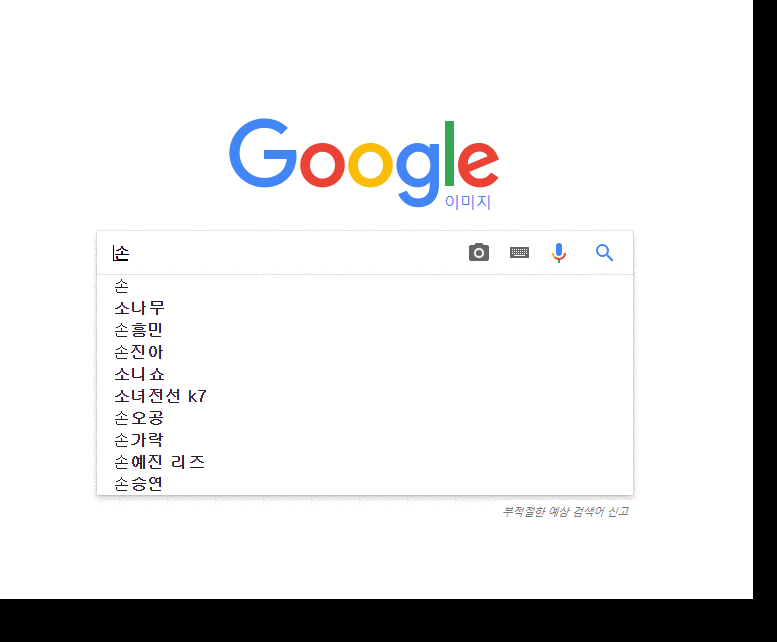

 
``` {r, include=FALSE}
source("tools/chunk-options.R")
knitr::opts_chunk$set(echo = TRUE, warning=FALSE, message=FALSE)
```


# 구글 제안 - 연관검색어 {#google-suggest}

구글 제안(Google Suggest)는 구글이 4년에 걸치 연구개발 결과 공개한 것으로 2008년부터 서비스를 제공하고 있다.
사용자들이 검색창에 일정한 단어를 입력하게 되면, 자동으로 검색어나 문장을 추천해 주는 기능으로 
다음이나, 네이버에서 제공하는 연관검색어와 유사성이 크다.



# 보고서 - 구글 연관검색어 {#report-google-suggest}

먼저 보고서에 구글 연관검색어를 넣는다는 느낌으로 구글에서 구글제안(suggest)을 받아와서 이를 시각화하는 코드를 작성해보자.

## 구글 연관검색어 가져오기 {#report-google-suggest-import}

다음과 네이버와 달리 구글에서 구글 제안(Suggest)는 API형태로 받아올 수가 있다.
따라서 **http://suggestqueries.google.com/complete/search?output=toolbar&q=두루킹**을 웹브라우저 주소창에 넣게 되면 XML 형태 결과값을 받아올 수 있다.

다음으로 XML 형태 검색어와 연관검색어를 바탕으로 2차 연관검색작업을 수행한다. 
가져온 데이터가 맞는지를 `listiviewer` 팩키지를 통해 살펴본다.

``` {r google-suggest-report}
# 0. 환경설정 ------
library(tidyverse)
library(rvest)
library(httr)
library(glue)
library(XML)
library(networkD3)
library(igraph)
library(urltools)

# 1. 데이터 가져오기 ------
## 구글 1차 연관검색어 --------------
### 구글 검색어
gsuggest_url <- "http://suggestqueries.google.com/complete/search?output=toolbar&q="
keyword <- "드루킹"

search_keyword <- glue(gsuggest_url, keyword)

### 구글 검색 실행
gsuggest_resp <- GET(search_keyword) %>% 
    content()

### 데이터프레임 변환
gsuggest_df <- gsuggest_resp %>% 
    xml_nodes('CompleteSuggestion') %>% 
    xml_node('suggestion') %>% 
    map(xml_attrs) %>% 
    map_df(~as.list(.))

## 구글 2차 연관검색어 --------------
gsuggest_list <- vector("list", length = 10)

for(i in 1:nrow(gsuggest_df)) {
    tryCatch({
        ## 검색어 생성
        search_2nd_keyword <- glue(gsuggest_url, url_encode(gsuggest_df$data[i]))
        ## 구글 검색 실행
        gsuggest_2nd_resp <- GET(search_2nd_keyword) %>% 
            content()
        
        ## 데이터프레임 변환
        gsuggest_2nd_df <- gsuggest_2nd_resp %>% 
            xml_nodes('CompleteSuggestion') %>% 
            xml_node('suggestion') %>% 
            map(xml_attrs) %>% 
            map_df(~as.list(.))
        
        gsuggest_list[[i]] <- gsuggest_2nd_df %>% 
            flatten()  
    }, error = function(e) {}) 
}

names(gsuggest_list) <- gsuggest_df$data

listviewer::jsonedit(gsuggest_list)
```

## 리스트 &rarr; 데이터프레임 {#report-google-suggest-list2df}

구글 연관검색을 받아왔으니 리스트를 데이터프레임으로 변환하는 작업을 수행한다.
다행히 `qdapTools` 팩키지 `list2df()` 함수를 사용하면 리스트를 간단히 데이터프레임으로 변환이 가능하다.

``` {r report-google-suggest-dataframe}
# 2. 리스트 --> 데이터프레임 ------
gsuggest_df <- qdapTools::list2df(gsuggest_list) %>% 
    rename(from=X2, to=X1) %>% 
    select(from, to)

R0R1_df <- gsuggest_df %>% 
    filter(from == keyword) 

gsuggest_df_list <- list(gsuggest_df, R0R1_df)

listviewer::jsonedit(gsuggest_df_list)

```

## 데이터프레임 &rarr; 시각화 {#report-google-suggest-network}

검색어, 1차 연관검색어, 2차 연관검색어 그룹지정을 한 후에 `forceNetwork()` 함수로 시각화해서 마무리한다.

``` {r df2network-google}
# 3. 시각화 ------
## 검색어 그룹 지정 
pre <- gsuggest_df_list[[1]] %>%
    graph_from_data_frame %>%
    igraph_to_networkD3

pre$nodes$group <- ifelse(pre$nodes$name %in% gsuggest_df_list[[2]]$from, "Keyword",
                          ifelse(pre$nodes$name %in% gsuggest_df_list[[2]]$to, "1st Relation", "2nd Relation"))

## 네트워크 시각화 ----
networkD3::forceNetwork(Links = pre$links, Nodes = pre$nodes,
                        colourScale = JS("d3.scaleOrdinal(d3.schemeCategory10);"),
                        Source = "source", Target = "target",
                        Group = "group", NodeID = "name",
                        opacity = 0.7, zoom = T,
                        fontSize = 13, fontFamily = "NanumGothic", legend = T,
                        opacityNoHover = 0.9)
```


# 자동화 함수 - 구글 연관검색어 {#function-google-suggest}

`visualize_gsuggest("드루킹")`와 같이 검색어를 넣으면 바로 시각화할 수 있도록 함수로 만들어보자.

- `crawl_google_suggest()`: 검색어를 넣으면 검색결과를 리스트로 반환하는 함수
- `list2df_google()`: `crawl_google_suggest()` 함수에서 반환받은 리스트를 데이터프레임으로 변환시키는 함수
- `visualize_gsuggest()`: 검색어를 입력받아 `crawl_google_suggest()`, `list2df_google()` 함수를 호출하여 시각화를 위한 자료형으로 변환시키고 나서 네트워크 시각화를 하는 함수

## 검색어 &rarr; 리스트 {#function-google-keyword-list}

`crawl_google_suggest()` 함수에 검색어를 넣으면 검색결과를 리스트로 반환하는 함수를 작성한다.

``` {r function-google-suggest-in-r}
# 1. 데이터 ------
## 1.1. 검색어 --> 리스트 ----
crawl_google_suggest <- function(keyword) {
    ### 구글 검색어
    gsuggest_url <- "http://suggestqueries.google.com/complete/search?output=toolbar&q="
    search_keyword <- glue(gsuggest_url, keyword)
    
    ### 구글 검색 실행
    gsuggest_resp <- GET(search_keyword) %>% 
        content()
    
    ### 데이터프레임 변환
    gsuggest_df <- gsuggest_resp %>% 
        xml_nodes('CompleteSuggestion') %>% 
        xml_node('suggestion') %>% 
        map(xml_attrs) %>% 
        map_df(~as.list(.))
    
    ## 구글 2차 연관검색어 --------------
    gsuggest_list <- vector("list", length = 0)

    for(i in 1:nrow(gsuggest_df)) {
        tryCatch({
            ## 검색어 생성
            search_2nd_keyword <- glue(gsuggest_url, url_encode(gsuggest_df$data[i]))
            ## 구글 검색 실행
            gsuggest_2nd_resp <- GET(search_2nd_keyword) %>%
                content()

            ## 데이터프레임 변환
            gsuggest_2nd_df <- gsuggest_2nd_resp %>%
                xml_nodes('CompleteSuggestion') %>%
                xml_node('suggestion') %>%
                map(xml_attrs) %>%
                map_df(~as.list(.))

            gsuggest_list[[i]] <- gsuggest_2nd_df %>%
                flatten()
        }, error = function(e) {})
    }

    names(gsuggest_list) <- gsuggest_df$data

    return(gsuggest_list)
}

druking_list <- crawl_google_suggest("드루킹")
listviewer::jsonedit(druking_list)
```

## 리스트 &rarr; 데이터프레임 {#function-google-keyword-list-df}

`list2df_google()` 함수는 리스트를 입력받아 데이터프레임으로 변환시키는 함수다.


``` {r function-google-suggest-list2df}
## 1.2. 리스트 --> 데이터프레임 ----

list2df_google <- function(gsuggest_list, keyword) {
    
    gsuggest_df <- qdapTools::list2df(gsuggest_list) %>% 
        rename(from=X2, to=X1) %>% 
        select(from, to)
    
    R0R1_df <- gsuggest_df %>% 
        filter(from == keyword) 
    
    gsuggest_df_list <- list(gsuggest_df, R0R1_df)
    
    return(gsuggest_df_list)
}

gsuggest_df_list <- list2df_google(druking_list, "드루킹")
listviewer::jsonedit(gsuggest_df_list)
```

## 키워드 &rarr; 시각화 {#function-google-keyword-viz}

`visualize_gsuggest()` 함수는 검색어를 입력받아 `crawl_google_suggest()`, `list2df_google()` 함수를 호출하여 시각화를 위한 자료형으로 변환시키고 나서 네트워크 시각화를 하는 함수다. 

``` {r function-google-suggest-visualize}
visualize_gsuggest <- function(keyword) {
    
    tmp_list <- crawl_google_suggest(keyword)
    
    gsuggest_df_list <- list2df_google(tmp_list, keyword)
    
    # 3. 시각화 ------
    ## 3.1. 데이터프레임 --> 네트워크 객체 ----
    pre <- gsuggest_df_list[[1]] %>%
        graph_from_data_frame %>%
        igraph_to_networkD3
    ## 3.2. 시각화 그룹 지정 ----
    pre$nodes$group <- ifelse(pre$nodes$name %in% gsuggest_df_list[[2]]$from, "Keyword",
                              ifelse(pre$nodes$name %in% gsuggest_df_list[[2]]$to, "1st Relation", "2nd Relation"))
    
    ## 3.3. 네트워크 시각화 ----
    networkD3::forceNetwork(Links = pre$links, Nodes = pre$nodes,
                            colourScale = JS("d3.scaleOrdinal(d3.schemeCategory10);"),
                            Source = "source", Target = "target",
                            Group = "group", NodeID = "name",
                            opacity = 0.7, zoom = T,
                            fontSize = 13, fontFamily = "NanumGothic", legend = T,
                            opacityNoHover = 0.9)
    
}

visualize_gsuggest("드루킹")
```


