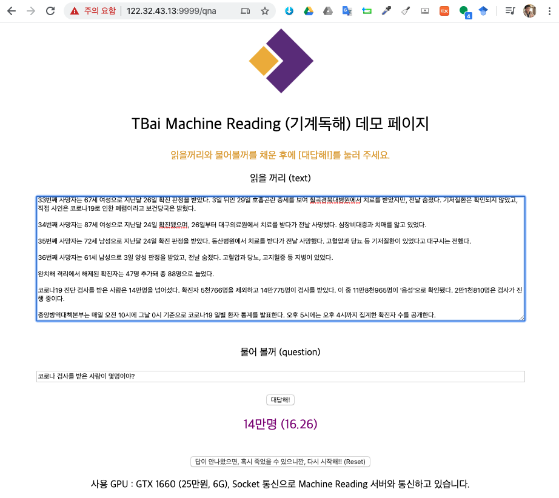

```{r, include=FALSE}
knitr::opts_chunk$set(echo = TRUE, warning=FALSE, message=FALSE,
                    comment="", digits = 3, tidy = FALSE, prompt = FALSE, fig.align = 'center')

library(tidyverse)
```

# API [^wiki-api] [^api-best-practices] {#wiki-api}

**API**(Application Programming Interface, 응용 프로그램 프로그래밍 인터페이스)는 응용 프로그램에서 사용할 수 있도록, 운영 체제나 프로그래밍 언어가 제공하는 기능을 제어할 수 있게 만든 인터페이스를 뜻한다. 

[^wiki-api]: [위키백과사전, API](https://ko.wikipedia.org/wiki/API)

[^api-best-practices]: [`httr`: "Best practices for API packages"](https://cran.r-project.org/web/packages/httr/vignettes/api-packages.html)

# 영국 범죄 API [^medium-api]  {#api-medium}

[^medium-api]: [Trafford Data Lab (Jul 26, 2018), "Querying APIs in R", Medium.com](https://medium.com/@traffordDataLab/querying-apis-in-r-39029b73d5f1)

영국 경찰은 범죄관련 데이터를 API를 통해 제공하고 있다. 기본적으로 API에 대한 설명과 사용예제를 담고 있으며 예제를 실행시켰을 경우 응답값도 함께 알려준다.

- API 문서: https://data.police.uk/docs/
- 사용례: https://data.police.uk/docs/method/crime-street/
    - https://data.police.uk/api/crimes-street/all-crime?lat=52.629729&lng=-1.131592&date=2017-01
    - https://data.police.uk/api/crimes-street/all-crime?poly=52.268,0.543:52.794,0.238:52.130,0.478&date=2017-01
    
API를 호출했을 때 반환되는 결과도 아래와 같이 친철히 반환값을 예시로 기술해준다.

```{r get-result-api}
library(webshot2)

webshot('https://data.police.uk/docs/method/crime-street/', selector = '#content > div > pre:nth-child(21)')
```

## 강도 데이터  {#api-medium}

강도(burglary) 데이터를 가져오려면 URL을 지정하고, `GET()`함수로 데이터를 끌어오는데 필요한 매개별수를 넘기고 `content()`함수로 데이터를 가져오는데 JSON 형태라 이를 데이터분석을 위한 데이터프레임으로 변환시킨다.

```{r}
library(tidyverse) 
library(httr) 
library(jsonlite)

get_burgalary <- function() {
  
  uk_police_url <- "https://data.police.uk/api/crimes-street/burglary"

  request <- GET(url = uk_police_url, 
              query = list(
                lat = 53.421813,
                lng = -2.330251,
                date = "2019-01")
              )
  
  resp <- content(request, as = "text", encoding = "UTF-8")
  
  parsed <- jsonlite::fromJSON(resp, flatten = TRUE) %>%
    data.frame()

  structure(
    list(
      content = parsed,
      response = resp
    ),
    class = "police_api"
  )
}

burglary <- get_burgalary()

listviewer::jsonedit(burglary)

burglary$content %>% 
  select(month, category,
         location = location.street.name,
         long = location.longitude,
         lat = location.latitude) %>% 
  as_tibble()
```

# 투블럭 AI {#two-block-ai}

투블럭 AI는 2019년 창업한 스타트업으로 인공지능 자연어 처리 엔진 개발에 매진을 하고 있으며 자체 개발한 엔진을 [TBai Machine Reading (기계독해) 데모 페이지](http://122.32.43.13:9999/qna)를 통해 제공하고 있다.

- 대상 문서: [코로나19 확진 438명 증가·총 5천766명..완치 88명·사망 36명(종합)](https://news.v.daum.net/v/20200305110209919)
- 질문: "코로나 검사를 받은 사람이 몇명이야?"
- 대답: 14만명 (16.26)

읽을 꺼리(text) 신문기사를 대상으로 물어 볼꺼(question)을 전달하면 대답으로 정확한 결과를 전달한 것이 확인된다.

```{r two-block-ai, fig.cap='투블록 AI 데모 페이지'}

```


## 파이썬 [^install-anaconda] [^anaconda-reticulate] {#python-two-block-ai}

[^install-anaconda]: [Install Python on Mac (Anaconda)](https://medium.com/@GalarnykMichael/install-python-on-mac-anaconda-ccd9f2014072)

[^anaconda-reticulate]: [Conda binary not found on macOS due to changed installation location #661](https://github.com/rstudio/reticulate/issues/661)

<https://repo.continuum.io/archive/> 웹사이트에서 다운로드 받을 해당 버전을 선택하여 설치를 했으나 맥OS가 Catalina로 버전업 되면서 루트에 설치하는 것이 원칙적으로 금지되었다. 
이런 경우 `reticulate::install_miniconda()` 명령어로 설치를 진행한다.


```{r install-miniconda, eval = FALSE}
reticulate::install_miniconda()
use_python('/Users/statkclee/Library/r-miniconda/bin/python')
repl_python()
Error in py_discover_config(required_module, use_environment) : 
  Python specified in RETICULATE_PYTHON (/anaconda3/bin/python3) does not exist
```

