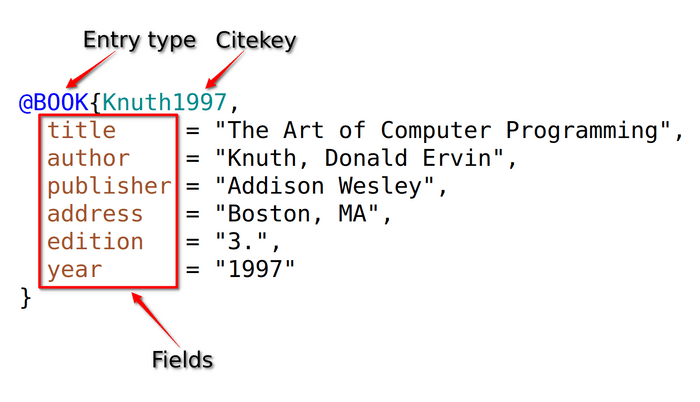

```{r setup, include=FALSE}
knitr::opts_chunk$set(echo = TRUE, message=FALSE, warning=FALSE,
                      comment="", digits = 3, tidy = FALSE, prompt = FALSE, fig.align = 'center')

```


# 논문 데이터 {#papers-bibliography}

[Dimensions](https://www.dimensions.ai/) 웹사이트에서 연구논문에 대한 서지목록을 가져온다. [BibTeX](https://www.bibtex.com/g/bibtex-format/)은 $\LaTeX$와 같은 인쇄저작시스템과 결합하여 문서 서지관리를 위해 제작된 파일형식으로 다음과 같은 형태로 구성된다.



다음과 같이 도널드 쿠누쓰 교수의 1997년 책을 `BibTeX` 형식에 맞춰 파일에 저장시키고 나서 `@knuth1997art` 같이 컴퓨터 프로그래밍 예술[@knuth1997art]을 참조하면 저작물 작성에 유용하다. 

$$1. Knuth DE. The art of computer programming. Pearson Education; 1997.$$

```{r bibtex-example, eval = FALSE}
@book{knuth1997art,
  title={The art of computer programming},
  author={Knuth, Donald Ervin},
  volume={3},
  year={1997},
  publisher={Pearson Education}
}
```

## `BibTeX` 데이터베이스 {#bibtex-database}

`BibTeX` 형태의 정보가 쌓이게 되면 이를 변환하여 데이터프레임으로 변환시킬 수 있다. 정형 데이터로부터 다양한 분석과 경우에 따라서는 예측모형 구축도 가능하게 된다.


[`bib2df`](https://docs.ropensci.org/bib2df/) 팩키지의 도움으로 `BibTeX` 파일을 데이터프레임으로 변환시킬 수 있다.

```{r bib2df}
library(tidyverse)
library(bib2df)
```

