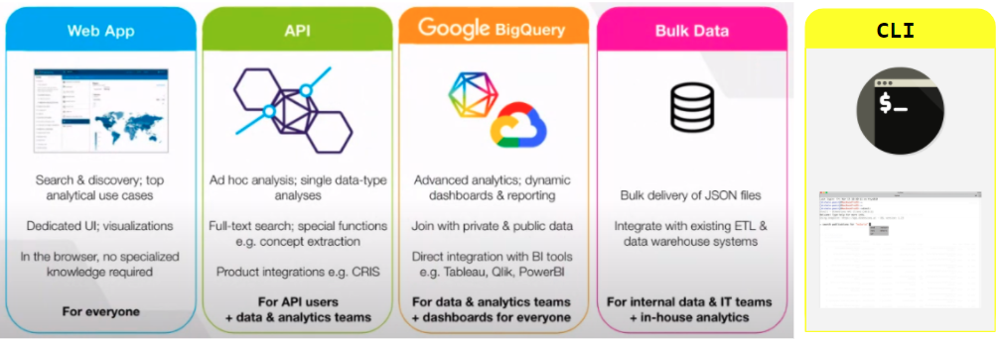

```{r setup, include=FALSE}
knitr::opts_chunk$set(echo = TRUE, message=FALSE, warning=FALSE,
                      comment="", digits = 3, tidy = FALSE, prompt = FALSE, fig.align = 'center')

```



# `Dimensions.ai` 인터페이스 {#dimensions-ai-interface}

연구개발자금부터 정책보고서에 이르는 전과정에서 창출되는 다양한 데이터를 한곳에서 모아 분석하고 유용한 것을 만들 수 있도록 다양한 인터페이스를 제공하고 있다.

- [웹 GUI 인터페이스](https://app.dimensions.ai/discover/publication)
- [API](https://www.dimensions.ai/resource-type/api/) &rarr; [`dimensionsR`](https://cran.r-project.org/web/packages/dimensionsR/index.html)

- [`dimcli`: A Command Line Interface for the Dimensions.ai DSL](https://github.com/digital-science/dimcli) &rarr; [`rdimensions`](https://github.com/nicholasmfraser/rdimensions)
- [Google bigquery](https://docs.dimensions.ai/bigquery/)

coronavirus|covid-19|sars-cov|ncov-2019|2019-ncov|hcov-19|sars-2

# [`dimensionsR`](https://cran.r-project.org/web/packages/dimensionsR/index.html) 팩키지 {#dimensions-pkg}

토큰을 받아야 하는데 <https://ds.digital-science.com/NoCostAgreement> 에서 지원서를 작성하고 최대 10일정도 기다려야 한다.
[dimensionsR Vignettes](https://cran.r-project.org/web/packages/dimensionsR/vignettes/A_Brief_Example.html)을 참조하여 나머지 후속과정을 준비한다.


```{r dimensionsR-pkg}
# devtools::install_github("massimoaria/dimensionsR")
library(dimensionsR)

```

