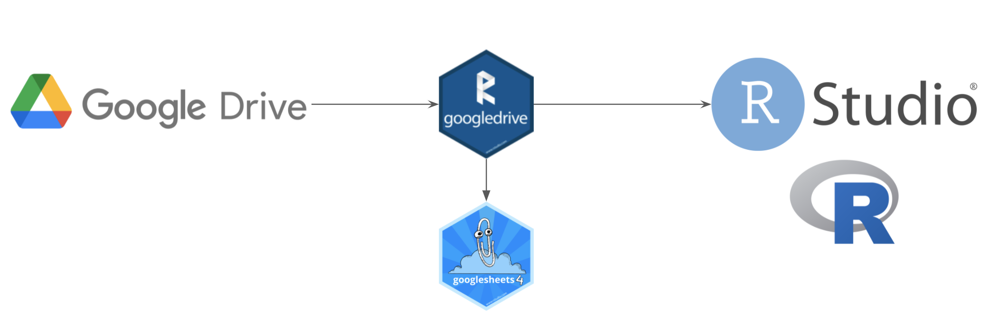
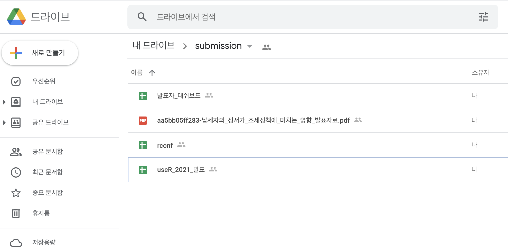

```{r setup, include=FALSE}
knitr::opts_chunk$set(echo = TRUE, message=FALSE, warning=FALSE,
                      eval = FALSE,
                      comment="", digits = 3, tidy = FALSE, prompt = FALSE, fig.align = 'center')
```



# `googledrive` {#googledrive-workflow}

구글 드라이브에 담긴 방대한 데이터를 RStudio 와 연결하여 데이터를 분석하고 모형을 제작하는 것이 얼마나 좋은 그림인가!!! 이를 위해서 [`googledrive`](https://googledrive.tidyverse.org/) 팩키지가 개발되어 손쉽게 작업을 할 수 있게 되었다. 특히 데이터가 구글 스프레드쉬트와 같은 직사각형 데이터의 경우 [`googlesheet4`](https://googlesheets4.tidyverse.org/)를 활용하여 바로 R 데이터프레임 객체로 변환시켜 후속 작업을 수월하게 수행할 수 있다.

# 구글 드라이브 인증 {#googledrive-authorization}

가장 먼저 구글 드라이브 계정에 접속하기 위해서는 인증절차를 밟아야 한다. `googledrive` 팩키지를 설치한 후에 `drive_auth()` 명령어를 실행하게 되면 연결시킬 구글 계정을 선택하게 되는 화면이 팝업되고 연결시킬 구글 드라이브를 지정하면 된다.

{width="326"}

# 파일 검색 {#googledrive-search}

[`googledrive` Get started](https://googledrive.tidyverse.org/) 웹사이트에서 구글 드라이브에 저장된 데이터에 접근하여 찾을 수 있는 다양한 방식이 지원된다.

-   `drive_find(n_max = 30)`
-   `drive_find(pattern = "chicken")`
-   `drive_find(type = "spreadsheet")` \#\# Google Sheets!
-   `drive_find(type = "csv")` \#\# MIME type = "text/csv"
-   `drive_find(type = "application/pdf")` \#\# MIME type = "application/pdf"

```{r googledrive-find}
library(tidyverse)
library(googledrive)
library(googlesheets4)

spreadsheet_list <- drive_find(type = "spreadsheet")
spreadsheet_list
```

# 파일 바로 읽어오기 {#googledrive-read}

`drive_find()` 함수를 통해 파일 정보를 확인한 후에 `id` 값을 가진 후에 이를 활용하여 바로 `googlesheets4` 팩키지 `read_sheet()` 함수로 로컬 컴퓨터에 저장하지 않고 R에서 바로 불러와서 후속 작업을 수행한다.

```{r googledrive-read-file}
file_id <- drive_get("dashboard")

presenter <- googlesheets4::read_sheet(file_id)

presenter %>%
  janitor::clean_names(ascii = FALSE) %>%
  select(1:5) %>%
  filter(!is.na(구분_5)) %>%
  DT::datatable()
```

# 파일 다운로드 [^1] {#googledrive-download}

[^1]: [Nick Bap (February 23, 2018), "Accessing Google Drive with R", Data Things and Stuff](https://nickbap.com/2018/02/23/accessing-google-drive-with-r/)

`drive_find()` 함수를 통해 파일 정보를 확인한 후에 `id` 값을 통해 해당 파일을 확인한 후에 아마도 가장 일반적인 방식은 로컬 컴퓨터에 저장시켜 `readr` 팩키지의 일반적인 파일 불러오기 작업흐름을 가져가는 것이 아닌가 싶다. 파일을 특정한 후에 MIME Type 을 지정하면 해당 파일 형식으로 저장할 수 있다. `MIME Type`에 대한 정보는 다음 IBM 웹사이트에서 가져올 수 있다.

-   [`MIME Type`](https://www.ibm.com/docs/en/wkc/cloud?topic=catalog-previews)

```{r googledrive-download-file}
## CSV -----
drive_download(file_id, path = "data/rconf_presenter", overwrite = TRUE, type = "csv")
## 엑셀 -----
drive_download(file_id, path = "data/rconf_presenter", overwrite = TRUE, type = "application/vnd.openxmlformats-officedocument.spreadsheetml.sheet")
```

`read_excel()` 함수를 사용해 구글 드라이브로부터 로컬 컴퓨터로 저장한

```{r googledrive-download-file-check}
library(readxl)

rconf_raw <- read_excel("data/rconf_presenter.xlsx")

rconf_tbl <- rconf_raw %>% 
  janitor::clean_names(ascii = FALSE) %>% 
  select(1:5) %>% 
  filter(!is.na(구분_5))

rconf_tbl %>% 
  DT::datatable()
```

# 구글드라이브로 업로드 {#googledrive-upload}

구글 드라이브로부터 받아온 파일에 대한 작업이 완료되었다면 다음 후속조치로 구글 드라이브에 파일을 올리는 것이다. `drive_upload()` 함수를 사용해서 깔끕하게 작업한다. [`writexl`](https://docs.ropensci.org/writexl/) 팩키지로 해당 데이터프레임을 스프레드쉬트 형태로 변형한 후 `drive_upload()` 함수를 사용해서 구글 드라이브로 올린다.

```{r writexl-drive-upload}
library(writexl)

rconf_tbl %>% 
  write_xlsx("data/rconf.xlsx")

drive_upload("data/rconf.xlsx",
             path = "submission/rconf.xlsx",
             type = "spreadsheet",
             overwrite = TRUE)
```

{width="728"}
