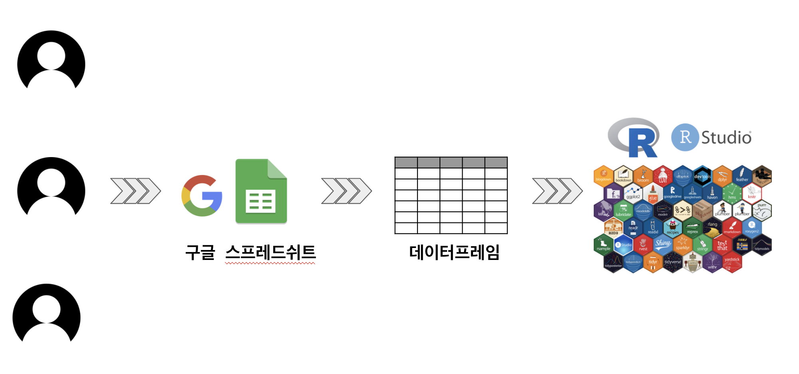
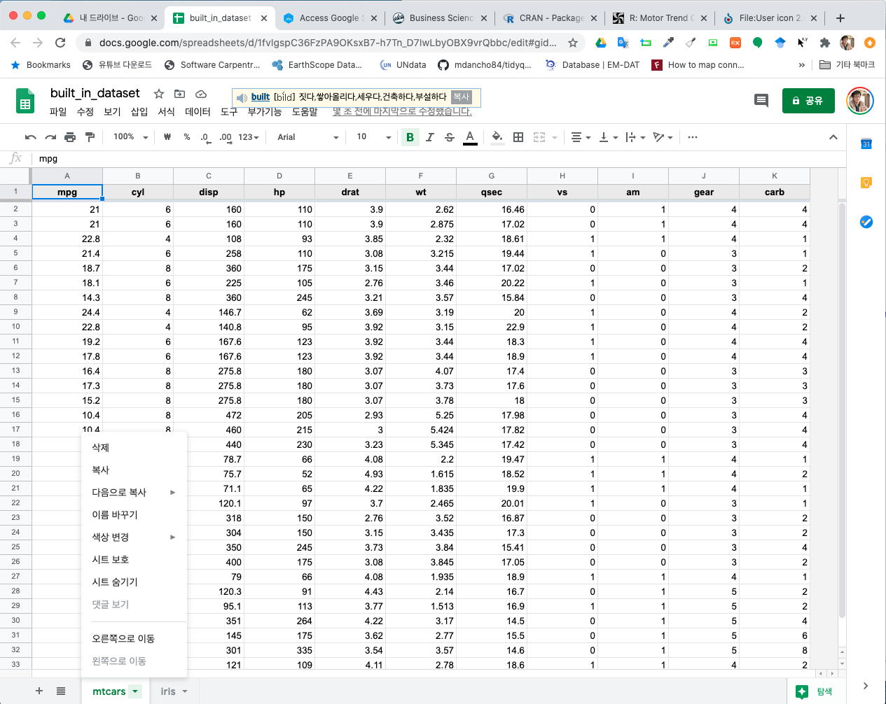

```{r setup, include=FALSE}
knitr::opts_chunk$set(echo = TRUE, message=FALSE, warning=FALSE,
                      comment="", digits = 3, tidy = FALSE, prompt = FALSE, fig.align = 'center')

library(googlesheets4)
```


# 정신 모델 (mental model) {-#mental-model}

멘탈 모델로 보면 구글 스프레드쉬트를 여러 사람이 한번에 작업하여 수장하게 되면 뒷쪽에서 `googlesheet4` 팩키지 `read_sheet()` 함수를 사용해서 데이터프레임으로 변환시킨 후에 후속 작업을 원하는 방식으로 추진할 수 있다.



# 구글 인증 {#google-auth}

- [googlesheets4 auth](https://googlesheets4.tidyverse.org/articles/articles/auth.html)
- [R과 Googlesheets를 함께 써보자 - 데이터저널리즘 협업 : R과 구글스프레드시트의 괜찮은 조합](https://brunch.co.kr/@yeowoonbae/25)
- [Jenny Bryan (2018-06-28), "Managing OAuth Tokens"](https://rawgit.com/jennybc/googlesheets/master/vignettes/managing-auth-tokens.html)

# 구글 스프레드쉬트 파일 {#googlesheet-file}

`googlesheets` 후속 버전으로 [`googlesheets4`](https://googlesheets4.tidyverse.org/) 가 새로 출시되었다. 전형적인 구글 인증과정을 거쳐 로컬 컴퓨터와 구글 드라이브를 연결시켜둔다.
내장된 데이터셋(`mtcars`, `iris`)를 엑셀의 쉬트처럼 두개 쉬트로 구성된 `built_in_dataset`을 생성한다.  

```{r create-googlesheet, eval = FALSE}
library(googlesheets4)

built_in_gsheet <- gs4_create("built_in_dataset", 
                              locale = "fr_FR",
                              sheets = list(mtcars=mtcars, iris=iris))

```

구글 스프레드쉬트로 열게 되면 다음과 같이 데이터프레임 두개가 각각 쉬트에 잘 저장된 것이 확인된다.



# 구글 엑셀파일 가져오기 {#googlesheet-file-read}

구글 드라이브에 앞서 저장된 구글 스프레드쉬트 파일을 꺼내는 방법은 몇가지 존재한다.
먼저 `read_sheet()` 함수를 사용해서 데이터프레임으로 꺼내오는 방법은 다음과 같다.

```{r read-googlesheets}
library(tidyverse)

# mtcars_gsheet <- googledrive::drive_get("built_in_dataset") %>% 
# read_sheet('mtcars')

mtcars_df <- read_sheet("https://docs.google.com/spreadsheets/d/1yemxGzjdqtNUvvi6VsNpl7-vuX_gs5RjvfkqEW0YNRs/edit#gid=537062310", sheet = "mtcars")

mtcars_df
```

