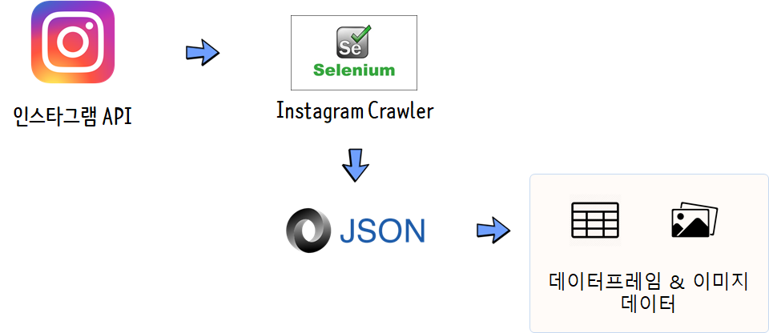

```{r, include=FALSE}
knitr::opts_chunk$set(echo = TRUE, warning=FALSE, message=FALSE,
                    comment="", digits = 3, tidy = FALSE, prompt = FALSE, fig.align = 'center')

library(tidyverse)
```

# 인스타그램 개요 [^wiki-instagram] {#insta-sns}

[^wiki-instagram]: [위키백과, "인스타그램"](https://ko.wikipedia.org/wiki/%EC%9D%B8%EC%8A%A4%ED%83%80%EA%B7%B8%EB%9E%A8)

[인스타그램(Instagram)](https://www.instagram.com/)은 온라인 사진 공유 및 소셜 네트워킹 서비스로, 사용자들은 인스타그램을 통해 사진 촬영과 동시에 다양한 디지털 필터(효과)를 적용하며 페이스북이나 트위터등 다양한 소셜 네트워킹 서비스에 사진을 공유할 수 있는데, 인스타그램의 가장 큰 특징은 정사각형의 사진이며 보통의 모바일 기기에서 사용하는 16:9 비율과 다르다.

# 데이터 가져오기 {#insta-ingest}

[`instaR`](https://cran.r-project.org/web/packages/instaR/) 팩키지와 몇가지 실험적인 R 팩키지가 개발되었으나 잦은 API 정책 변경 등으로 인하여 [Instagram Crawler](https://github.com/huaying/instagram-crawler)를 사용하여 데이터를 얻는 것도 좋은 방법이다. 

## 설치방법 {#insta-install}

1. 크롬(Chrome) 브라우저 설치를 확인한다.
1. [`instagram-crawler`](https://github.com/huaying/instagram-crawler)을 다운로드 받아 적당한 디렉토리에 설치한다.
1. [chromedriver](https://sites.google.com/a/chromium.org/chromedriver/)를 다운로드 받아 `./inscrawler/bin/chromedriver`에 넣어둔다.
    - 즉, `instagram-crawler\inscrawler\bin\chromedriver.exe`
1. 셀레리움(Selenium) 설치한다.
    - `pip install -r requirements.txt`
1. 마지막, 파일명 변경한다.
    - `cp inscrawler/secret.py.dist inscrawler/secret.py`

## 기본 사용법 {#basic-usage}

```{r basic-usage, eval = FALSE}
positional arguments:
  mode
    options: [posts, posts_full, profile, hashtag]

optional arguments:
  -n NUMBER, --number NUMBER
                        number of returned posts
  -u USERNAME, --username USERNAME instagram's username
  -t TAG, --tag TAG     instagram's tag name
  -o OUTPUT, --output OUTPUT output file name(json format)
  --debug               see how the program automates the browser
  --fetch_comments      fetch comments
  --fetch_likes_plays   fetch like/play number
  --fetch_likers        fetch all likers
  --fetch_mentions      fetch users who are mentioned in the caption/comments (startwith @)
  --fetch_hashtags      fetch hashtags in the caption/comments (startwith #)
  --fetch_details       fetch username and photo caption
```

## 예제 {#instagram-example}

`crawler.py` 프로그램을 사용해서 인스타그램에서 데이터를 가져올 수 있다. 

- 프로파일 관련: `python crawler.py profile -u 777byung -o ./data/profile`
- 활동성 통계 데이터: `python crawler.py posts_full -u 777byung -n 100 --fetch_likes_plays -o ./data/post_full.json`

```{r instagram-example, eval = FALSE}
python crawler.py posts_full -u 777byung -n 100 -o ./output
python crawler.py posts_full -u 777byung -n 100 --fetch_likes_plays -o ./data/post_full.json
python crawler.py posts_full -u 777byung -n 100 --fetch_likers --fetch_likes_plays -o ./data/post_full.json
python crawler.py posts_full -u 777byung -n 10 --fetch_comments
python crawler.py profile -u 777byung -o ./data/profile
python crawler.py hashtag -t taiwan -o ./output
python crawler.py hashtag -t taiwan -o ./output --fetch_details
python crawler.py posts -u 777byung -n 100 -o ./data/post.json # deprecated
python liker.py 777byung
```

# 탐색적 데이터분석 {#instagram-EDA}

{#id .class width="100%"}

원본데이터가 `.json`으로 저장되어 있어 이를 텍스트 편집기에서 보는 것은 다소 불편할 수 있다. 이를 보완하기 위해서 <http://www.jsonparseronline.com/> 웹사이트에서 보기 편한 형태로 자료형에 대한 기본적인 방향성에 대한 감을 얻을 수 있다.

## 프로파일 {#instagram-EDA-profile}

`profile.json` 파일을 가져와서 기본적인 계정(`777byung`)에 대한 정보를 얻어온다.

```{r instagram-json-profile}
library(jsonlite)
profile <- fromJSON("data/profile.json", flatten=TRUE)

profile %>% 
  enframe() %>% 
  mutate(value = map_chr(value, 1)) %>% 
  DT::datatable()
```


## 좋아요 추세 {#instagram-EDA-trend}

`post_full.json` 파일을 가져와서 좋아요 추세를 살펴본다.

```{r instagram-json}
library(jsonlite)
insta <- fromJSON("data/post_full.json", flatten=TRUE)

insta %>% 
  mutate(date = as.Date(datetime)) %>% 
  ggplot(aes(x=date, y=likes, group=1)) +
    geom_line() +
    geom_point() +
    labs(x="", y="좋아요수", title="인스타그램 김병욱 의원 좋아요 추이",
         subtitle="계정명: 777byung") +
    theme_bw()
```
