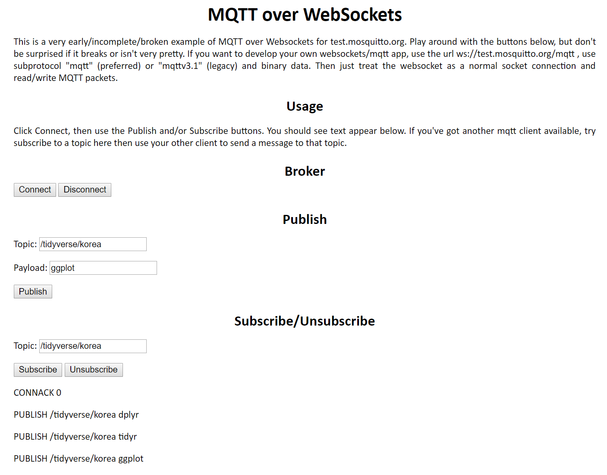

```{r setup, include=FALSE}
knitr::opts_chunk$set(echo = TRUE, message=FALSE, warning=FALSE,
                      comment="", digits = 3, tidy = FALSE, prompt = FALSE, fig.align = 'center')

library(reticulate)
use_condaenv("anaconda3")
# reticulate::repl_python()
```


# 사물인터넷 [^namu-iot] {#iot}

[^namu-iot]: [나무위키, "사물인터넷"](https://namu.wiki/w/%EC%82%AC%EB%AC%BC%EC%9D%B8%ED%84%B0%EB%84%B7)

사물인터넷(Internet of Things, IoT) 용어는 
1999년에 MIT의 오토아이디센터(Auto ID Center)의 
케빈 애시턴이 RFID와 센서 등을 활용하여 사물에 탑재된 인터넷이 발달할 것이라 
예측한 데서 비롯되었고, 유비쿼터스와 비슷하지만 기존의 자체적인 통신시스템을
인터넷이란 체제에 흡수함으로 더 확장된 개념이다. 
사물인터넷은 사람과 사람간의 통신을 넘어 사물에 IP 주소를 부여하고 사람과 사물, 
혹은 사물과 사물간의 통신을 이끌어내는 기술을 일컫는다. 
흔히 원격에서 조작을 하는 기기를 사물인터넷으로 생각하곤 하는데, 
사물인터넷은 그 기기에 설정된 인터넷시스템까지 포함한다.


# `mqtt` 팩키지 {#iot-mqtt}

‘MQTT’는 machine-to-machine (‘M2M’)/“Internet of Things” 연결 프로토콜로 다양한 장점이 있어,
특히 이 분야 표준 프로토콜로 자리잡고 있다.

## 사전 작업 [^mac-mosquuitto] {#iot-mqtt-mosquitto}

[^mac-mosquuitto]: [Setting up mosquitto (mqtt) and brew on mac os](https://gist.github.com/KazChe/6bcafbaf29e10a7f309d3ca2e2a0f706)

[`mosquitto`](https://mosquitto.org/download/) 라이브러리를 먼저 운영체제에 설치하는 것이 
여러모로 편리한다.

`sudo brew install mosquitto` 명령어를 사용하면 `mosquitto`가 제대로 설치되었는지 테스트 할 수 있다.

1. `mosquitto_sub -t topic/state` 명령어를 실행하여 메시지를 전달받을 수 있도록 구독(subscription) 한다.
1. 또 다른 윈도우를 띄워넣고, `mosquitto_pub -t topic/state -m "IoT 세상에 오신것을 환영합니다."` 명령어로 메시지를 퍼블리쉬한다.

``` {python prerequisite-mqtt, eval=FALSE}
$ brew install mosquitto
$ brew services start mosquitto
==> Tapping homebrew/services
Cloning into '/usr/local/Homebrew/Library/Taps/homebrew/homebrew-services'...
remote: Enumerating objects: 17, done.
remote: Counting objects: 100% (17/17), done.
remote: Compressing objects: 100% (14/14), done.
remote: Total 17 (delta 0), reused 12 (delta 0), pack-reused 0
Unpacking objects: 100% (17/17), done.
Tapped 1 command (50 files, 62.6KB).
==> Successfully started `mosquitto` (label: homebrew.mxcl.mosquitto)
$ mosquitto_sub -t topic/state
IoT 세상에 오신것을 환영합니다.
```


# 데이터 가져오기 {#iot-mqtt-get-data}

```{python, eval=FALSE}
# Import mqtt library
reticulate::repl_python()
import paho.mqtt.client as paho
port = 1883
host = "localhost"
keepalive = 60
def on_publish(client,userdata,result):
    print("data published \n")
    pass
client1= paho.Client("control1")
client1.on_publish = on_publish
client1.connect(host,port,keepalive)
ret= client1.publish("Robot","Robot 1 move_left")
```

[MQTT over WebSockets](http://test.mosquitto.org/ws.html) 웹사이트가 브로커 역할을 수행한다. 따라서 이곳에 `Publish`를 하고, `Subscribe/Unsubscribe`통해서 구독한 것을 받아오는 과정을 시각적으로 확인할 수 있다.



```{python iot-mqtt-publish}
import paho.mqtt.publish as publish

tidyverse_msgs = [
    {
        'topic':"/tidyverse/korea",
        'payload':"dplyr"
    },

    (
        "/tidyverse/korea",
        "tidyr", 
    )]

publish.multiple(tidyverse_msgs, hostname="test.mosquitto.org")
```

`/tidyverse/korea` 토픽으로 `dplyr`과 `tidyr`을 `http://test.mosquitto.org`으로 publish하여 전달한다.
다음으로 `paho.mqtt.publish` 모듈을 사용해서 앞서 publish한 사항을 `/tidyverse/korea` 토픽에 `subscribe`하여 가져온다.

```{python iot-mqtt-subscription}
import paho.mqtt.subscribe as subscribe

msg = subscribe.simple("/tidyverse/korea", hostname="test.mosquitto.org")

# topic과 payload 출력
print(f"{msg.topic}, {msg.payload}")
```


