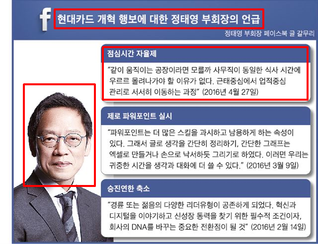

```{r setup, include=FALSE}
knitr::opts_chunk$set(echo = TRUE, message=FALSE, warning=FALSE,
                      comment="", digits = 3, tidy = FALSE, prompt = FALSE, fig.align = 'center')

library(tidyverse)
library(reticulate)
use_condaenv("anaconda3")
# reticulate::repl_python()
```


# PPT 장표 {#ocr-ppt}

대한민국에서 작성되는 많은 문서는 보고용으로 PPT 파일을 많이 사용한다. 따라서 워드나 아래한글 파일에 저장된 문서가 아니라 경우에 따라서는 PPT 파일에서 텍스트를 추출하는 것이 더 적합한 경우다.

이를 위해서 PPT 파일을 우선 이미지 파일로 저장시키고 저장된 이미지 파일에서 OCR 기술을 적용시켜 원하는 텍스트를 추출한다. PPT 장표는 일반적으로 가로형으로 사진 혹은 그래프, 상자박스에 담긴 제목이 있는 글과 본문으로 흔히 구성된다. [한국일보, "청바지 입고 PPT 없애고… DNA 바꾼 현대카드 미래는"](https://www.hankookilbo.com/News/Read/201605260454289391) 기사내용에 담긴 PPT 장표와 유사한 이미지를 바탕으로 다양한 상상의 나래를 펼쳐보자.



# 장표문서 미리보기 {#raw-data-image}

`magick` 팩키지는 R에서 이미지를 처리하는 팩키지로 PPT 장표를 우선 이미지로 변환시킨 후에 이를 바탕으로 추가 작업을 진행한다.

```{r raw-data-image}
library(tidyverse)
library(tesseract)
library(magick)

jangpyo_img <- image_read("fig/ppt-jangpyo.jpg") %>% 
  image_convert() %>% 
  image_rotate(.,0) %>% 
  image_trim(fuzz = 40) 

image_info(jangpyo_img)

jangpyo_img
```

# 텍스트 추출 {#raw-data-extract-text}

텍스트를 추출할 때 이미지 전체에서 텍스트를 추출한 것보다 특정 지역을 지정하고 해당 지역에서 텍스트를 추출하는 것도 가능한데 이런 경우 해당 이미지 좌표를 지정해야 하는데 
[WebPlotDigitizer](https://automeris.io/WebPlotDigitizer/)가 큰 도움이 된다.

해당 이미지를 <(https://apps.automeris.io/wpd/)> 웹사이트에 올려 이미지에서 추출할 텍스트 위치를 좌표로 찍어 명세하여 추출한다.

```{r raw-data-extract-text}
# tesseract_download("kor")
# kor <- tesseract("kor")

## 장표 제목
장표제목 <- image_crop(jangpyo_img, geometry_area(x_off=90, y_off=25, 530-90, 53-25), repage = FALSE) %>% 
  image_trim() %>%
  image_noise() %>% 
  image_enhance() %>% 
  image_normalize() %>% 
  image_contrast(sharpen = 1) %>% 
  image_ocr_data(language = "kor") %>% 
  select(word) %>% 
  pull() %>% 
  paste0(collapse=" ")

## 점심시간 자율제
점심시간 <- image_crop(jangpyo_img, geometry_area(x_off=185, y_off=80, 590-185, 200-99), repage = FALSE) %>% 
  image_convert(type = 'Bilevel') %>% 
  image_ocr_data(language = "kor") %>% 
  select(word) %>% 
  pull() %>% 
  paste0(collapse="")

```

# 문서 추출 데이터 {#raw-data-extract-text-dt-viz}

## 추출한 데이터 {#raw-data-extract-text-dt}

`image_draw()` 함수를 사용해서 실제 특정 지역을 특정하고 OCR로 이미지를 추출한 영역을 시각화하여 확인한다.

```{r raw-data-extract-text-DT-viz}

ppt_box <- image_draw(jangpyo_img) 

rect(80, 05, 530, 35, border = "red", lwd = 5)
rect(185, 80, 590, 200, border = "red", lwd = 5)

dev.off()

ppt_box
```

## 추출한 데이터 {#raw-data-extract-text-dt-DT}

추출한 데이터를 데이터프레임으로 정리하여 후속 작업을 준비한다.

```{r raw-data-extract-text-DT}
ppt_df <- tibble(
  "장표제목" = 장표제목,
  "점심시간" = 점심시간
)

ppt_df %>% 
  gather(장표제목, 점심시간) %>% 
  DT::datatable()
```


