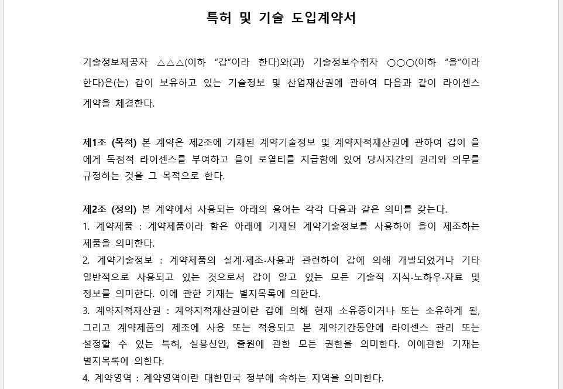

```{r setup, include=FALSE}
knitr::opts_chunk$set(echo = TRUE, message=FALSE, warning=FALSE,
                      comment="", digits = 3, tidy = FALSE, prompt = FALSE, fig.align = 'center')

library(reticulate)
use_condaenv("anaconda3")
# reticulate::repl_python()
```


# `tesseract` 문자인식 {#tesseract-ocr}

[`tesseract`](https://opensource.google.com/projects/tesseract)를 통해서 
100개가 넘는 언어를 사용해서 문서에 포함된 문자를 인식시킬 있는 광학 문자 판독 (optical character recognition, OCR) 엔진이다.

# `tesseract` 헬로월드 {#tesseract-hello-world}

[tesseract 소품문](https://cran.r-project.org/web/packages/tesseract/vignettes/intro.html)에 포함된 영문 예제로부터 시작해보자. 아래 영문에서 텍스트를 추출할 수 있다.


```{r tesseract-hello-world}
library(tidyverse)
library(tesseract)

eng <- tesseract("eng")
text <- tesseract::ocr("http://jeroen.github.io/images/testocr.png", engine = eng)
cat(text)
```


# `tesseract` 텍스트 위치 {#tesseract-hello-world-box}

상기 이미지에서 추출된 단어에 대한 위치정보가 포함되어 있다.

```{r tesseract-hello-world-box}
results <- tesseract::ocr_data("http://jeroen.github.io/images/testocr.png", engine = eng)
results %>% 
  DT::datatable()
```

가장 문자인식율이 높은 단어는 `test`로 96.9844284057617, 가장 낮은 단어는 `on` 93.5358657836914으로 나타난다.
이를 `bbox` 정보가 함께 제공되니 이를 이미지에 겹쳐 보자. 이를 위해서 [`magick`](https://cran.r-project.org/web/packages/magick/vignettes/intro.html) 팩키지를 활용하여 구현해보자.

동일한 문서를 가져와서 `image_draw()` 함수로 기존 이미지위에 도형을 올릴 수 있다. 
`tesseract::ocr_data()` 함수를 사용해서 이미지에서 인식한 텍스트 위치를 특정시킬 수 있고 그 정보는 `bbox` 칼럼에 저장된다. 앞서 가장 인식이 잘 된 것이라고 판단된 단어와 반대 단어를 추출하여 이를 단어 박스를 씌워보자.

```{r tesseract-hello-world-box-magick}
library(magick)
document_ocr <- image_read('http://jeroen.github.io/images/testocr.png')

document_box <- image_draw(document_ocr)

results_df <- results %>% 
  mutate(loc = str_split(bbox, ",")) %>% 
  mutate(top_x = map_chr(loc, 1),
         top_y = map_chr(loc, 2),
         bottom_x = map_chr(loc, 3),
         bottom_y = map_chr(loc, 4))

(most_conf <- results_df %>% 
  top_n(1, wt=confidence) )

(least_conf <- results_df %>% 
  arrange(confidence) %>% 
  head(1) )

rect(most_conf$top_x, most_conf$top_y, most_conf$bottom_x, most_conf$bottom_y, border = "blue", lty = "solid", lwd = 3)

rect(least_conf$top_x, least_conf$top_y, least_conf$bottom_x, least_conf$bottom_y, border = "red", lty = "solid", lwd = 3)

dev.off()

print(document_box)

```


# 한국어 인식 {#tesseract-korean}

웹사이트에 공개된 [국문계약서 샘플 - 14, 특허 및 기술 도입 라이선스 계약서 샘플 – License and Distribution Agre…](http://kasanlaw.com/bbs/board.php?bo_table=sub04_1&wr_id=132)을 다운로드 받아 한국어 문자인식 작업을 추진해보자.



## 한국어 설정 {#tesseract-korean-dictionary}

먼저 [tesseract ocr](https://github.com/tesseract-ocr/tesseract/wiki/Data-Files) 한국어 데이터를 다운로드 받아 설치한다. `tesseract_info()$available` 명령어를 통해 한국어 엔진이 설치된 것을 확인한다.

```{r tesseract-contract-korean}
# tesseract_download("kor")
tesseract_info()$available
```

## 한국어 문자 인식 설정 {#tesseract-korean-doit}

`tesseract::ocr` 명령어에 더해서 `engine = kor`을 설정하게 되면 문서의 한국어를 인식하게 된다.

```{r tesseract-contract-korean-contract}
kor <- tesseract("kor")
contract_text <- tesseract::ocr("fig/ocr-contract-sample.png", engine = kor)

contract_text
```

## 문자 인식 신뢰도 {#tesseract-korean-confidence}

영문과 동일하게 한국어 문자 인식 신뢰도를 파악한다. 

```{r tesseract-contract-korean-confidence}
contract_df <- tesseract::ocr_data("fig/ocr-contract-sample.png", engine = kor)
contract_df %>% 
  DT::datatable()
```

## 문자 인식 신뢰도 {#tesseract-korean-confidence}

인식된 문자에 대한 신뢰도 파악을 위해서 계약서 이미지에 가장 잘 인식된 문자와 그렇지 않는 문자를 시각화한다.


```{r tesseract-contract-korean-confidence-viz}
contract_ocr <- image_read('fig/ocr-contract-sample.png')

contract_box <- image_draw(contract_ocr)

contract_df <- contract_df %>% 
  mutate(loc = str_split(bbox, ",")) %>% 
  mutate(top_x = map_chr(loc, 1),
         top_y = map_chr(loc, 2),
         bottom_x = map_chr(loc, 3),
         bottom_y = map_chr(loc, 4))

(most_conf <- contract_df %>% 
  top_n(1, wt=confidence) )

(least_conf <- contract_df %>% 
  arrange(confidence) %>% 
  head(1) )

rect(most_conf$top_x, most_conf$top_y, most_conf$bottom_x, most_conf$bottom_y, border = "blue", lty = "solid", lwd = 3)

rect(least_conf$top_x, least_conf$top_y, least_conf$bottom_x, least_conf$bottom_y, border = "red", lty = "solid", lwd = 3)

dev.off()

print(contract_box)

```

