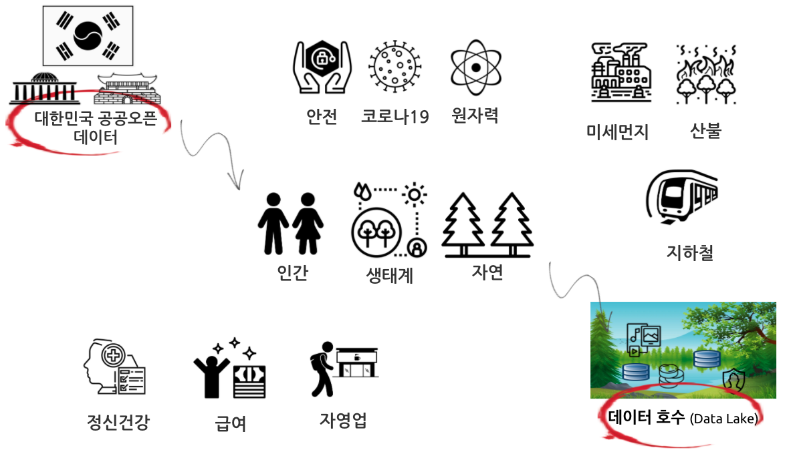

```{r setup, include=FALSE}
knitr::opts_chunk$set(echo = TRUE, message=FALSE, warning=FALSE,
                      comment="", digits = 3, tidy = FALSE, prompt = FALSE, fig.align = 'center')
```



# 공공데이터 선택 기준 [@oh2021] {#public-open-data}

데이터로부터 가치를 만들 수 있는 공공데이터를 다음에서 발견할 수 있다.

- 시의성: 최신 정보에서 가치를 찾음
- 흥미
    - 일탈성: 일상에서 벗어난 사건으로 사회질서를 위협하는 사건에서 가치를 찾음
    - 진기성: 일반적인 상식에서 벗어난 비정상적인 사건일수록 가치가 높음
    - 진기성: 일반적인 상식에서 벗어난 비정상적인 이상점(outlier)이 가치가 높음.
    - 인간적 흥미: 흥미로운 사건이 가치가 높음.
    - 선정성: 감정을 자극하는 사건이 가치 혹은 관심이 높음.
    - 저명성: 유명한 사람, 기관, 장소, 물건일수록 가치가 높음.
- 갈등성: 다툼과 변화에서 가치를 찾음
- 영향성: 사람, 사회에 미치는 영향이 클수록 가치가 높음.
- 근접성: 지리적, 심리적, 인간적으로 밀접한 소식일수록 가치가 높음.

# 공공데이터 분석과제 {#public-data-tasks}

- 서울 미세먼지 분석 
    - 원천 데이터 웹사이트: [서울특별시 대기환경정보](https://cleanair.seoul.go.kr/)
    - [대기질 통계] &rarr; [기간별 통계] &rarr; [일별평균] &rarr; [측정기간], [측정물질]
        - 초미세먼지, 미세먼지, 오존, 이산화질소, 일산화탄소, 아황산가스
- 수도권 지하철 승하차 인원 분석
    - 원천 데이터 웹사이트: [공공데이터포털](https://www.data.go.kr/)
        - 검색창: "지하철 호선별 역별 승하차 인원 정보"
- 한국인 정신건강 분석
    - 원천 데이터 웹사이트: [한국행정연구원](https://www.kipa.re.kr/)
        - [정보공개] &rarr; [DB활용신청] &rarr; [이용안내] &rarr; [데이터 신청 바로가기]
    - 한국행정연구원 [갈등 DB](https://www.kipa.re.kr/site/kipa/conflict/selectCaseList.do)
- 서울의 음식점 현황 분석
    - 원천 데이터 웹사이트: [지방행정 인허가 데이터 개방](https://www.localdata.go.kr/)
        -  [데이터 받기] &rarr; [데이터 다운로드] &rarr; 전체 데이터 다운로드, 업종 다운로드, 지역 다운로드
- 한국인의 급여 실태 분석
    - 원천 데이터 웹사이트: 한국보건사회연구원 [한국복지패널 홈페이지](https://www.koweps.re.kr/)
        - [데이터&설문지] &rarr; [15차 웨이브]
- 전국 산불 피해면적 
    - 원천 데이터 웹사이트: [산림청 산불발생현황](https://huyang.forest.go.kr/kfsweb/kfi/kfs/frfr/selectFrfrStatsNow.do?mn=NKFS_02_02_01_05)
        - Geocoding 된 [엑셀 다운로드](data/sanbul_geocode_r_meetup.xlsx)

# 갈등 DB {#conflict-db}    

## 갈등 DB 첫 테이블 {#conflict-table}    
    
갈등사례DB 첫번째 테이블을 가져온다.    
    
```{r conflict-database}
library(tidyverse)
library(httr)
library(rvest)

# 1. 데이터 받아오기 -----
## 1.1 POST() 함수를 사용하여 개표 결과를 수집합니다.
resp <- POST(
    url = 'https://www.kipa.re.kr/site/kipa/conflict/selectCaseList.do',
    body = list(
      pageIndex         = "1",
      searchStartYear   = "",
      searchEndYear     = "",
      searchConfCause   = "",
      searchBizType     = "",
      searchConfType    = "",
      searchConfSubject = "",
      searchCondition   = "all",
      searchKeyword     = ""
    )
  )

conflict_tbl <- content(x = resp, as = 'text') %>% 
  read_html() %>% 
  html_node(xpath = '//*[@id="ConflictCaseVo"]/div/table[2]') %>% 
  html_table(fill=TRUE) %>% 
  # janitor::clean_names() %>% 
  as_tibble() 

conflict_tbl
```
    
## 갈등 DB 함수 {#conflict-table}    
    
갈등사례DB 페이지를 가져오는 함수를 작성한다.
    
```{r conflict-database-function}

get_conflict_cases <- function(page_index) {
  
  resp <- POST(
      url = 'https://www.kipa.re.kr/site/kipa/conflict/selectCaseList.do',
      body = list(
        pageIndex         = page_index,
        searchStartYear   = "",
        searchEndYear     = "",
        searchConfCause   = "",
        searchBizType     = "",
        searchConfType    = "",
        searchConfSubject = "",
        searchCondition   = "all",
        searchKeyword     = ""
      )
    )
  
  conflict_tbl <- content(x = resp, as = 'text') %>% 
    read_html() %>% 
    html_node(xpath = '//*[@id="ConflictCaseVo"]/div/table[2]') %>% 
    html_table(fill=TRUE) %>% 
    # janitor::clean_names() %>% 
    as_tibble() 
  
  return(conflict_tbl)
}

get_conflict_cases("49")
```
        
        
## 갈등 DB 데이터프레임 {#conflict-dataframe}    
    
갈등사례DB 페이지를 가져와서 데이터프레임으로 모두 저장한다.
    
```{r conflict-database-to-dataframe, eval = FALSE}

# page_index_vec <- str_pad(1:49, width = 2, side = "left", pad = "0")

conflict_DB_tbl <- map_df(1:49, get_conflict_cases)

conflict_DB_tbl %>% 
  write_rds("data/conflict_DB_tbl.rds")
```


```{r conflict-dataframe-reactable}
conflict_DB_tbl <- read_rds("data/conflict_DB_tbl.rds")

conflict_DB_tbl %>% 
  reactable::reactable()
```


