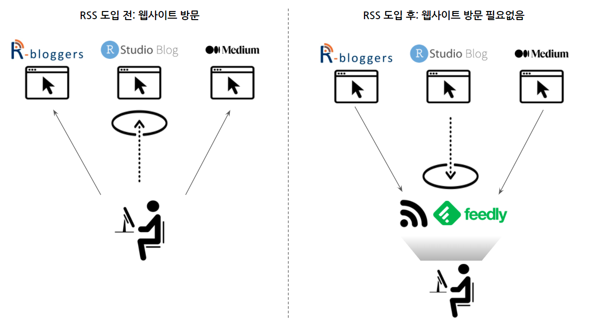
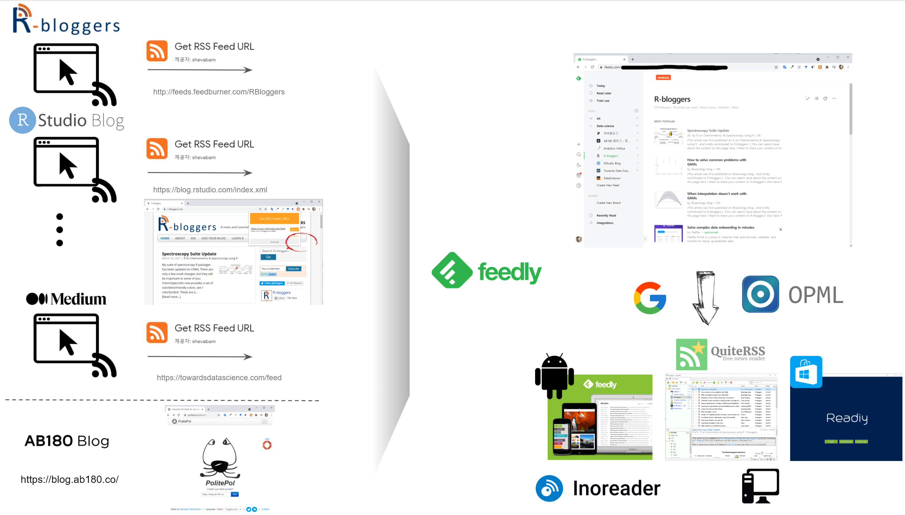
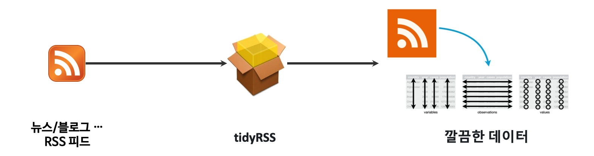

```{r setup, include=FALSE}
knitr::opts_chunk$set(echo = TRUE, message=FALSE, warning=FALSE,
                      comment="", digits = 3, tidy = FALSE, prompt = FALSE, fig.align = 'center')

library(tidyverse)
```


# RSS {#ingest-rss}

[RSS](https://en.wikipedia.org/wiki/RSS)는 원래 RDF Site Summary에서 출발하여 Rich Site Summary, Really Simple Syndication으로 알려진 웹 사용자 혹은 응용프로그램이 온라인 콘텐츠를 가져오게 된 표준규약으로 "자연어 처리"의 중요한 말뭉치(Corpus)의 한 축을 담당하고 있다.

- [유명한 RSS 피드 모음](https://raw.githubusercontent.com/DataWookie/feedeR/master/tests/testthat/test-feeds.txt)



# RSS 작업흐름 [^rss-workflow] {#ingest-rss-workflow}

[^rss-workflow]: [달새랑 월하독앱 (2019-05-16), "RSS 사용법 AtoZ! 정보는 수집하라고 있는거다! 응?", 유튜브](https://www.youtube.com/watch?v=tug4XPfn0RY)

블로그 글을 기계가 긁어갈 수 있도록 웹사이트에 허락하는 경우 준비된 RSS를 가져오면 된다. 크롬을 사용하게 되면 "RSS Feeds URLs" 플러그인을 사용하게 되면 우측 상단에서 웹사이트에서 바로 RSS Feeds URL을 수집하여 [feedly.com](https://feedly.com/)에 저장하여 관리하면 된다. 만약, 웹사이트에서 정보를 공개는 하지만 RSS Feeds를 제공하지 않는 경우 [politepol.com](https://politepol.com/en/) 에서 수동으로 블로그 글을 추출하여 RSS Feeds URL을 생성시켜 [feedly.com](https://feedly.com/)에 저장시키 활용하면 된다.

RSS 주소를 한곳 예를 들어 [feedly.com](https://feedly.com/) 저장해 두게 되면 다음 단계로 이를 다양한 RSS 리더(Reader)를 사용해서 읽으면 된다. [feedly.com](https://feedly.com/)은 안드로이드 앱도 지원하니 구글 계정을 연결시키면 끝. PC에서는 두가지 방법이 존재하는데 Windows Store에서 Readiy 를 설치하는 방법과 [QuiteRSS](https://quiterss.org/en/download)를 설치하고 [feedly.com](https://feedly.com/)에서 OPML로 내려받기 해서 이를 QuiteRSS에 연결시키게 되면 콘텐츠를 실시간으로 소비할 수 있다.





# `tidyRSS` 헬로월드 {#ingest-rss-feed}


RSS를 R에서 가져오는데 [tidyRSS](https://github.com/RobertMyles/tidyrss) 팩키지가 개발되어 수월하게 텍스트 데이터를 가져올 수 있다. RSS 텍스트 데이터를 처리하는 기본 작업 흐름은 다음과 같다.
과거 별도 RSS 팩키지를 사용해야 했지만, `tidyRSS`가 RSS, Atom, JSON, geoRSS 피드도 받아내는 기능이 있어 [feedeR](https://github.com/DataWookie/feedeR) 팩키지를 참조해도 좋을 듯 싶다.

```{r include-image, fig.cap="RSS 데이터 작업흐름도"}

```


[https://statmodeling.stat.columbia.edu/](https://statmodeling.stat.columbia.edu/) 웹사이트의 블로그 RSS 피드를 `tidyRSS` 팩키지 `tidyfeed()` 함수를 사용해서 블로그 텍스트를 가져온다. 
가져온 데이터를 `tidytext` 자연어 처리 흐름에 맞춰 데이터프레임으로 정제하고 `ggplot`으로 시각화한다.

```{r rss-address}
library(tidyRSS)
library(tidytext)
library(tidyverse)

## RSS 블로그 데이터 가져오기
rss <- tidyfeed("https://statmodeling.stat.columbia.edu/feed/") 

DT::datatable(rss)

## 텍스트 데이터 전처리
rss_tbl <- rss %>%
  unnest_tokens(word, item_title) %>% 
  anti_join(stop_words) %>% 
  inner_join(get_sentiments("bing"), by = "word") %>% 
  mutate(week = lubridate::week(feed_pub_date))

## 감성분석 시각화
ggplot(rss_tbl, aes(x = sentiment)) +
  geom_bar(aes(fill = sentiment), colour = "black") +
  theme_classic() +
  scale_fill_manual(values = c("#616161", "#FFD700"))
```

# 한글 RSS {#ingest-rss-feed-korean}

[국내 48곳 언론사/포탈 뉴스 RSS 모음](http://w3devlabs.net/wp/?p=52)을 통해서 주요 언론사 뉴스 RSS를 받아볼 수 있다.

<style>
div.blue { background-color:#e6f0ff; border-radius: 5px; padding: 10px;}
</style>
<div class = "blue">

**`xmlXPathEval: evaluation failed`** 오류 발생시 [Install libxml2 on Mac OSX](http://macappstore.org/libxml2/)을 참조하여 `libxml2`를 설치하여 해결한다.

```{r rss-ingest, eval=FALSE}
> hani_rss <- tidyfeed("http://www.hani.co.kr/rss/") 
xmlXPathEval: evaluation failed
```

</div>


```{r hani-rss, eval=FALSE}
joins_rss <- tidyRSS::tidyfeed("http://rss.joinsmsn.com/joins_news_list.xml") 
```

