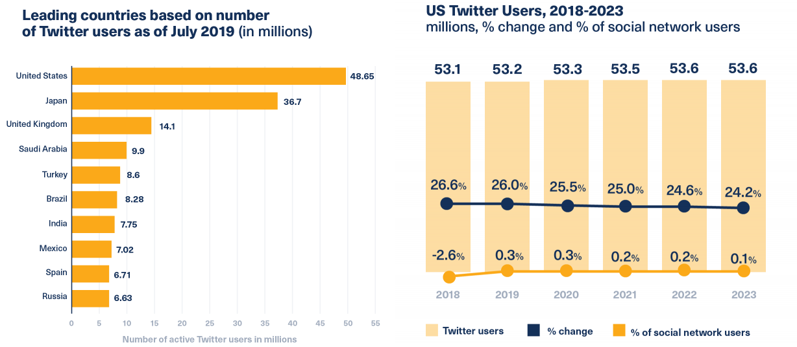

```{r, include=FALSE}
knitr::opts_chunk$set(echo = TRUE, warning=FALSE, message=FALSE,
                    comment="", digits = 3, tidy = FALSE, prompt = FALSE, fig.align = 'center')

library(tidyverse)
```

# 트위터 SNS {#twitter-sns}

"트윗(tweet)"이란 말은 작은 새가 지저귀는 소리를 나타내는 영어 낱말로, 
[트위터(영어: Twitter)](https://www.twitter.com/)는 **소셜 네트워크 서비스(SNS)**이자 **마이크로블로그** 서비스로 볼 수 있다.

단문 메시지 서비스(SMS), 인스턴트 메신저, 전자 우편(e-mail) 등을 통해 "트윗(tweet)"를 전송할 수 있고, 글 한 편에 해당하는 단위는 트윗으로 140자가 한도가 된다. 
한글이든 영문이든, 공백과 기호를 포함해 한 번에 140 까지 글자를 올릴 수 있다.
최근 [Donald J. Trump](https://twitter.com/realdonaldtrump) 대통령이 트워터를 적극적으로 정치에 활용하면서 다시 관심을 받고 있는 서비스이기도 하다.

## 트위터 통계 [^twitter-stats] {#twitter-stats}

[^twitter-stats]: [Hootsuite, "25 Twitter Stats All Marketers Need to Know in 2020"](https://blog.hootsuite.com/twitter-statistics/)

월기준으로 3.3억 사용자가 있으며, 매일 5억개의 트윗이 있고, 사용자의 80%가 축복받은 1980~2000년 초반 출생한 밀레니얼 세대이며, 생중계 동안 트위터 광고는 11% 더 효과적으로 알려져 있으며 구매자의 40%는 트위터의 영향을 받는 것으로 조사된다.

1. Twitter has 145 million monetizable daily active users
2. Twitter’s U.S. user base is predicted to grow 0.3% in 2020
3. 30 million (or 20%) of Twitter’s daily users are American
4. 92% of the U.S. population is familiar with Twitter (even if they don’t use it)



## 트위터 데이터 {#twitter-stats-data}

`rtweet` 팩키지 `stream_tweets()` 함수는 공개가 허락된 트윗 중에서 1%를 무작위로 가져오는데 기본설정으로 30초 동안 트윗을 추출한다.

## 트위터 활용분야 {#twitter-data-application}

트위터 데이터를 분석해서 다양한 분야에 활용할 수 있다. 대표적으로 다음을 들 수 있다.

- 최신 유행 주제 발굴
- 고객 의견(customer opinion)
- 대중 감정 / 민심
- 브랜드/영화/연애인 영향력 범위
- 이벤트 탐지: 시위 혹은 전염병

# 트위터 계정 - `rtweet` {#setup-twitter-account}

[`httpuv`: HTTP and WebSocket server package for R](https://github.com/rstudio/httpuv)를 기반한 [`rtweet`: R client for accessing Twitter’s REST and stream APIs](https://rtweet.info/) 팩키지로 천하통일 되었다고 볼 수 있다.

- `httpuv`: 웹브라우저를 통해 트위터 API를 인증할 수 있게 함. 따라서, 별도 트위터 개발자 페이지에 접속해서 인증키를 받아 이를 활용할 필요가 없어짐.
- `rtweet`: 트위터 API에서 데이터를 추출해서 분석이 가능한 형태의 데이터프레임으로 가공하여 반환시킴

설치는 `install.packages("rtweet")`으로 하면 쉽게 설치되고 별도 인증절차 없이 처음 브라우저 인증을 위한 과정만 추가된다. 이후 `search_tweets()` 등 함수를 사용해서 트위터 API에서 데이터를 수집하면 된다.

```{r rtweet-setup}
# 0. 환경설정 -----
library(rtweet)  # install.packages("rtweet")
library(tidyverse)

tidyverse_tw <- search_tweets("#tidyverse", n = 100, include_rts = TRUE, lang = "en")
tidyverse_tw
```

# 최신 유행 주제 {#twitter-trends}

가장 먼저 특정 지역에 가장 유행하는 주제가 무엇인지 찾아보자. 이를 **트위터 트렌드(twitter trend)**라고 흔히 부른다. `get_trends()` 함수를 사용하게 되면 전세계 트윗을 해쉬태그(hashtag), 키워드, 이벤트, 지역 등을 분석해서 최신 유행하는 주제를 파악할 수 있다.

```{r trend-topics}
trend_topics <- get_trends()
trend_topics %>% 
  DT::datatable()
```

`trends_available()` 함수를 사용하게 되면 추출가능한 트렌드에 대한 정보를 얻을 수 있는데 `countryCode`를 한국("KR")으로 특정해서 대한민국과 연관된 트렌드만 파악할 수 있도록 한다.

```{r available-trend-topics}
availabel_trends <- trends_available()

availabel_trends %>% 
  filter(countryCode == "KR")
```

## 대한민국 유행 주제 {#trend-korea}

2019-12-28 오후 10시 "#SBS는_책임져라" 해쉬태그가 가장 유행하는 주제로 나온다.

```{r trend-korea}
korea_woeid <- availabel_trends %>% 
  filter(countryCode == "KR", woeid == 23424868) %>% 
  select(woeid) %>% 
  pull(woeid)

korea_trend <- get_trends(korea_woeid)

korea_trend %>% 
  group_by(trend) %>% 
  summarise(mean_tweet_volume = mean(tweet_volume, na.rm = TRUE)) %>% 
  arrange(desc(mean_tweet_volume))
```

궁금해서 twitter에 검색을 해보니... 레드벨벳 웬디가 SBS '가요대전' 추락사고가 발생되서 팬들이 SBS를 질타하는 내용임을 확인할 수 있다. 

<blockquote class="twitter-tweet"><p lang="ko" dir="ltr">사고 발생 후 4일이 흘렀는데 아직도 이게 안됩니까?<br><br>사고 경위, 사고 발생 원인과 책임 소재 규명, 총책임자의 사과, 구체적인 피해 보상계획, 사고 재발 방지를 위한 대책이 포함된 정식 사과문. <a href="https://twitter.com/hashtag/SBS%EB%8A%94_%EC%B1%85%EC%9E%84%EC%A0%B8%EB%9D%BC?src=hash&amp;ref_src=twsrc%5Etfw">#SBS는_책임져라</a><a href="https://twitter.com/hashtag/TakeResponsibilitySBS?src=hash&amp;ref_src=twsrc%5Etfw">#TakeResponsibilitySBS</a><a href="https://twitter.com/SBSNOW?ref_src=twsrc%5Etfw">@SBSNOW</a><a href="https://twitter.com/hashtag/WaitingForWendy?src=hash&amp;ref_src=twsrc%5Etfw">#WaitingForWendy</a></p>&mdash; 린넨커튼&amp;벨벳로프 (@dj_netrider) <a href="https://twitter.com/dj_netrider/status/1210844831963996160?ref_src=twsrc%5Etfw">December 28, 2019</a></blockquote> <script async src="https://platform.twitter.com/widgets.js" charset="utf-8"></script>

# 클라우드 인기 시계열 {#aws-azure-gcp}

클라우드 경쟁이 치열하다. 아마존 AWS를 비롯하여 마이크로소프트 Azure, Google Cloud, IBM 그리고 최근에는 알리바바가 폭풍성장을 하고 있다. [CIODIVE, "AWS to encounter IaaS market 'erosion' as contenders mature"](https://www.ciodive.com/news/iaas-Azure-AWS-Google-Cloud-Alibaba/559716/) 기사 내용과 비교하여 한국에서 트윗되고 있는 내용과 비교해보자.

```{r cloud-market-share}
library(rvest)

cloud_url <- "https://www.ciodive.com/news/iaas-Azure-AWS-Google-Cloud-Alibaba/559716/"

cloud_df <- cloud_url %>% 
  read_html() %>% 
  html_nodes(xpath='//*[@id="main-content"]/article/div[2]/div[2]/div/div[1]/div[3]/table') %>% 
  html_table() %>% 
  .[[1]]

cloud_df %>% 
  select(-`Growth, 2017-2018`) %>% 
  pivot_longer(cols=contains("Market")) %>% 
  mutate(value = parse_number(value) / 100) %>% 
  mutate(name = str_replace(name, "Market share, ", "MS_")) %>% 
  mutate(Company = factor(Company, levels = c("Amazon", "Microsoft Azure", "Alibaba", "Google Cloud","IBM", "Others"))) %>% 
  ggplot(aes(x=name, y=value, fill=name)) +
    geom_col() +
    scale_y_continuous(labels = scales::label_percent(accuracy = 1)) +
    facet_wrap(~Company) +
    labs(x="", y="시장 점유율(%)") +
    scale_fill_manual(values=c("darkgray", "blue")) +
    theme_bw() +
    theme(legend.position = "none")
```

`lang="ko"`로 클라우드 3사를 비교하는 것은 트윗이 너무 적어서 포기함.

```{r cloud-market-share-twitter, eval=FALSE}
aws_tw <- search_tweets("#AWS", n = 18000, include_rts = FALSE, lang="ko")
azure_tw <- search_tweets("#Azure", n = 18000, include_rts = FALSE, lang="ko")
gcp_tw <- search_tweets("#GCP", n = 18000, include_rts = FALSE, lang="ko")
alibaba_tw <- search_tweets("#AlibabaCloud", n = 18000, include_rts = FALSE, lang="ko")
```

`n = 18000`을 두는 이유는 최대 트윗 갯수가 18,000이라 최대한 트윗을 땡겨온다.
**Rate limit exceeded - 88** 이슈가 있어 1,800으로 트윗 갯수를 줄여서 작업한다.
현재 시점 `r Sys.Date()` 최근 1주일정도 추세를 보는데 큰 무리는 없어 보인다.

```{r cloud-market-share-twitter-world, eval=TRUE}
aws_tw <- search_tweets("#AWS", n = 1800, include_rts = FALSE)
azure_tw <- search_tweets("#Azure", n = 1800, include_rts = FALSE)
gcp_tw <- search_tweets("#googlecloud", n = 1800, include_rts = FALSE)
alibaba_tw <- search_tweets("#AlibabaCloud", n = 1800, include_rts = FALSE)

aws_ts_df <- ts_data(aws_tw, by="hours")
azure_ts_tw <- ts_data(azure_tw, by="hours")
gcp_ts_tw <- ts_data(gcp_tw, by="hours")
alibaba_ts_tw <- ts_data(alibaba_tw, by="hours")

aws_ts_df %>% 
  rename(aws=n) %>% 
  left_join(azure_ts_tw, by="time") %>% 
  rename(azure=n) %>% 
  left_join(gcp_ts_tw, by="time") %>% 
  rename(google=n) %>% 
  left_join(alibaba_ts_tw, by="time") %>% 
  rename(alibaba=n) %>% 
  pivot_longer(-time) %>% 
  ggplot(aes(x=time, y=value, color=name, group=name)) +
    geom_line() +
    geom_point() +
    labs(x="", y="트윗횟수", color="클라우드 서비스") +
    theme_bw() +
    theme(legend.position = "top")
```


# 활동성 - `#CloudComputing` {#cloud-computing-activity}

`#CloudComputing`을 가장 많이 언급하는 트윗 사용자를 찾아보자.
이를 위해서 먼저 `search_tweets()` 함수로 해쉬태그 "#CloudComputing"을 넣고 `screen_name`을 기준으로 트윗횟수를 세어본다.

```{r cloud-computing-activity}
cloud_twts <- search_tweets("#CloudComputing", n=18000)

cloud_twts %>% 
  count(screen_name, name="트윗수", sort=TRUE)
```

`#CloudComputing` 해쉬태그 상위 10명을 추출하여 `lookup_users()` 함수로 활동성과 관련된 지표를 추출한다.

- status
- followers
- friends
- favourites

```{r cloud-computing-lookup-users}
top_users <- cloud_twts %>% 
  count(screen_name, name="트윗수", sort=TRUE) %>% 
  top_n(10, wt=트윗수) %>% 
  pull(screen_name)

lookup_users(top_users) %>% 
  # select(screen_name, contains("_count")) %>% 
  select(screen_name, statuses_count, followers_count, friends_count, favourites_count)
```

트윗 유저 상기 활동성 지표를 `ggplot`으로 시각화하여 각 사용자별 특성을 직관적으로 파악할 수 있도록 한다.

```{r cloud-computing-lookup-users-viz}
lookup_users(top_users) %>% 
  select(screen_name, statuses_count, followers_count, friends_count, favourites_count) %>% 
  pivot_longer(-screen_name) %>% 
  ggplot(aes(x=screen_name, y=value, fill=screen_name)) +
    geom_col() +
    coord_flip() +
    scale_y_continuous(labels=scales::comma) +
    facet_wrap(~name, scales = "free") +
    labs(x="", y="") +
    theme_bw() +
    theme(legend.position = "none")
```