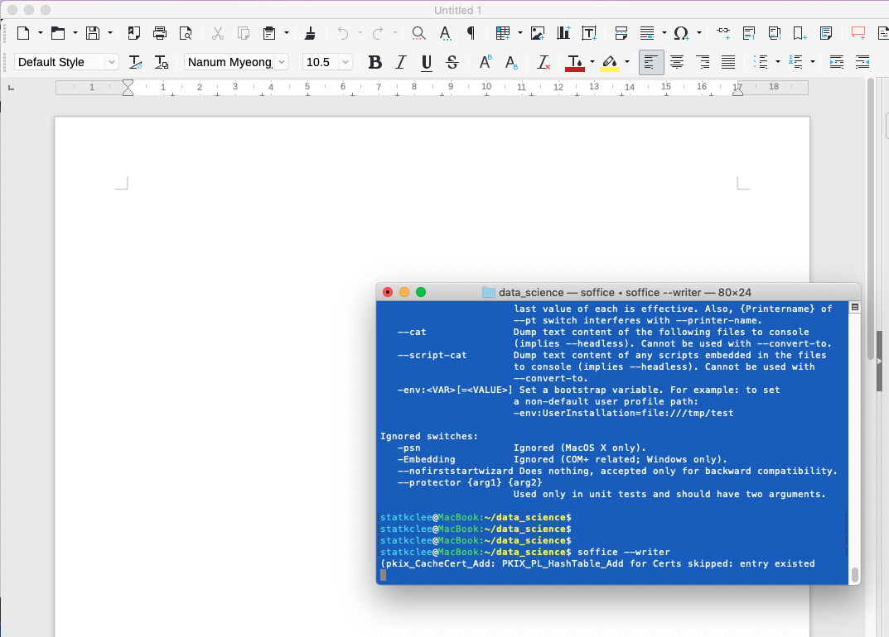

```{r, include=FALSE}
knitr::opts_chunk$set(echo = TRUE, warning=FALSE, message=FALSE,
                    comment="", digits = 3, tidy = FALSE, prompt = FALSE, fig.align = 'center')

library(tidyverse)
```

# [리브레오피스](https://ko.wikipedia.org/wiki/리브레오피스) {#pdf-extract-table}

[리브레오피스(LibreOffice)](https://ko.wikipedia.org/wiki/리브레오피스)는 다양한 플랫폼에서 사용할 수 있는 오피스 제품군으로 마이크로소프트 오피스를 비롯한 주요 오피스 제품군과 호환되고, 워드에 대응되는 라이터(Writer), 엑셀에 대응되는 캘크(Calc), 파워포인트에 대응되는 임프레스(Impress), 도표 프로그램인 비지오에 대응되는 드로(Draw), 데이터베이스 액세스에 대응되는 베이스(Base), 수식편집기인 매스(Math)로 구성되어 있다.

리브레(Libre)는 라틴어에서 유래되어 로망스어군에서 흔히 쓰이는 자유(free)를 뜻하는 어간이고, 오피스(office)는 영어 단어이다. 특정한 기업으로부터 자유로운 자유 소프트웨어라는 의미를 담아 지어졌다.

- 홈페이지: <https://www.libreoffice.org/>
- 저장소: <https://gerrit.libreoffice.org/plugins/gitiles/core>

# 명령라인 설치 [^install-mac-libreOffice] {#install-libreOffice}

[^install-mac-libreOffice]: [Mac App Store, "Install LibreOffice on Mac OSX"](http://macappstore.org/libreoffice/)

1. `Command` + `Space` 를 쳐서 터미널을 연다.
2. 다음 명령어를 복사하여 붙여 넣는다.

```{bash install-libreOffice, eval = FALSE}
ruby -e "$(curl -fsSL https://raw.githubusercontent.com/Homebrew/install/master/install)" < /dev/null 2> /dev/null ; brew install caskroom/cask/brew-cask 2> /dev/null
```

3. `brew cask install libreoffice` 명령어를 실행시킨다.

# 실행 맛보기 {#install-libreOffice-hello-world}

`soffice --help` 명령어를 실행시키게 되면 명령라인에서 가능한 인자값을 파악할 수 있다.

```{bash libreOffice-hellowrld}
soffice --help | head -n 20
```


만약 문서편집을 위해서 라이터를 실행할 경우 `$ soffice --writer` 명령어를 실행시키면 된다.

{#id .class width="77%"}


