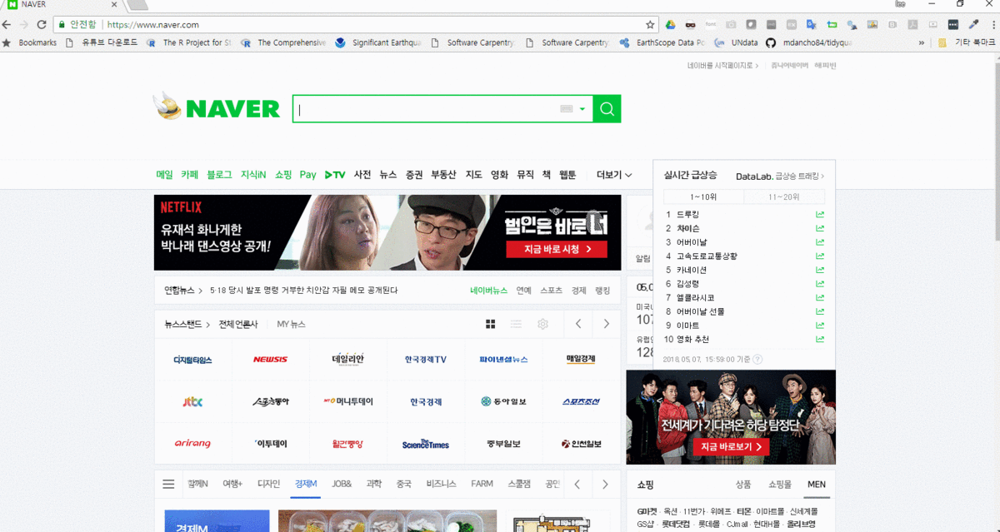

 
``` {r, include=FALSE}
source("tools/chunk-options.R")
knitr::opts_chunk$set(echo = TRUE, warning=FALSE, message=FALSE)
```

# 네이버 인물정보 {#naver-people-info}

네이버 인물정보에는 다양한 정보가 숨겨져 있다. 
이를 크롤링하여 데이터프레임으로 변환한 후에 데이터분석을 하면 그동안 볼 수 없었던 새로운 사실을 많이 확인할 수 있다.



# 국회의원 소셜 계정 {#naver-social}

국회의원은 의정활동을 통해 많은 사실을 알리는 것과 함께 유권자들로부터 많은 의견을 듣고자 한다.
이런 목적으로 컴퓨터 통신 환경 변화에 가장 빠르게 대응하는 국민이 정치인이 아닌가라는 생각이 든다.

국회의원 소셜 계정을 크롤링하여 가장 많이 운영되는 소셜 계정이 어떤 것인지 데이터를 통해 확인해보자.

## 제20대 국회의원 목록 {#naver-social-congressman}

가장 먼저 제20대 국회의원 목록이 필요하다. 이를 위해서 
위키백과사전에서 [대한민국 제20대 국회의원 목록 (지역구별)](https://ko.wikipedia.org/w/index.php?title=%EB%8C%80%ED%95%9C%EB%AF%BC%EA%B5%AD_%EC%A0%9C20%EB%8C%80_%EA%B5%AD%ED%9A%8C%EC%9D%98%EC%9B%90_%EB%AA%A9%EB%A1%9D_(%EC%A7%80%EC%97%AD%EA%B5%AC%EB%B3%84))를
긁어오자.

위키백과사전에서 ULR을확인했으니 `rvest` 팩키지를 활용하여 `xpath`를 찾아 이를 서울특별시부터, 제주도까지 긁어온다.

``` {r 국회의원}
# 0. 환경설정 -----
library(httr)
library(rvest)
library(tidyverse)
library(urltools)
library(glue)
library(extrafont)
loadfonts()

# 1. 국회의원 명단 -----
## 1.1. 긁어오기 -----
Sys.setlocale("LC_ALL", "C")
url <- "https://ko.wikipedia.org/wiki/%EB%8C%80%ED%95%9C%EB%AF%BC%EA%B5%AD_%EC%A0%9C20%EB%8C%80_%EA%B5%AD%ED%9A%8C%EC%9D%98%EC%9B%90_%EB%AA%A9%EB%A1%9D_(%EC%A7%80%EC%97%AD%EA%B5%AC%EB%B3%84)"

cm_list <- vector("list", length=19)

for(idx in 1:17) {
  cm_list[[idx]] <- url %>% 
    read_html() %>% 
    html_node(xpath = glue('//*[@id="mw-content-text"]/div/table[', idx+2, ']')) %>% 
    html_table(fill=TRUE) %>% 
    as_tibble()
}

Sys.setlocale("LC_ALL", "Korean")

## 1.2. 시도별 국회의원 정보 -----
cm_list <- cm_list[1:17] 
names(cm_list) <- c("서울특별시","부산광역시","대구광역시","인천광역시","광주광역시","대전광역시","울산광역시","세종특별자치시","경기도","강원도","충청북도","충청남도","전라북도","전라남도","경상북도","경상남도", "제주특별자치도")

## 2.3. 리스트 --> 데이터프레임 -----

name_v <- map(cm_list, "이름") %>% flatten %>% unlist %>% as.character()
precinct_v <- map(cm_list, "선거구") %>% flatten %>% unlist %>% as.character()
party_v <- map(cm_list, "소속정당") %>% flatten %>% unlist %>% as.character()
geo_v <- map(cm_list, "관할구역") %>% flatten %>% unlist %>% as.character()
num_v <- map(cm_list, "선수") %>% flatten %>% unlist %>% as.character()

cm_df <- data.frame(이름=name_v, 
           선거구=precinct_v,
           정당=party_v,
           지역=geo_v,
           선수=num_v) %>% 
  separate(이름, into=c("한글명", "한자"), sep="\\(" ) %>% 
  filter(!is.na(한자))

DT::datatable(cm_df)

```

## 네이버 인물정보 {#naver-people-info}

### 네이버 인물정보 - 한명  {#naver-people-info-crawl}

네이버 인물정보를 한명 긁어오는 것은 큰 의미가 없지만, 추후 함수로 만들어서 모든 국회의원 정보를 가져오는 경우 필요하기 때문에 순차적으로 작성해본다.
먼저 성남시 분당을 지역구를 갖고 있는 [김병욱](https://search.naver.com/search.naver?where=nexearch&sm=top_hty&fbm=0&ie=utf8&query=%EA%B9%80%EB%B3%91%EC%9A%B1) 의원의 인물정보를 긁어와보자.

``` {r 김병욱}
# 1. 데이터: 네이버 인물정보 -----

## 1.1. 네이버 주소 -----
url <- "https://search.naver.com/search.naver?where=nexearch&sm=top_hty&fbm=1&ie=utf8&query="
people_name <- "김병욱"

naver_url <- glue({url}, {people_name})

## 1.2. 네이버 인물정보 긁어오기 -----
### 사진정보 
pic_info <- read_html(naver_url) %>% 
  html_node(xpath = '//*[@id="people_info_z"]/div[2]/div/div/a[1]') %>% 
  html_node(xpath = 'img') %>% 
  html_attr('src')
  
pic_info_df <- tibble(key="사진", value=pic_info)

### 인물정보 
key <- read_html(naver_url) %>% 
        html_node(xpath = '//*[@id="people_info_z"]/div[2]/div/dl') %>% 
        html_nodes('dt') %>% 
        html_text() %>% 
        as_tibble() %>% 
        rename(key=value)

value <- read_html(naver_url) %>% 
  html_node(xpath = '//*[@id="people_info_z"]/div[2]/div/dl') %>% 
  html_nodes('dd') %>% 
  html_text() %>% 
  .[-1]

p_info_df <- bind_cols(key=key, value=value) %>% 
  bind_rows(pic_info_df)

DT::datatable(p_info_df)
```

### 네이버 인물정보 - 함수  {#naver-people-info-crawl-function}

매번 수작업으로 인물정보를 내려받아 가져오는 대신에 
함수를 만들어서 전체 국회의원에 대한 정보를 가져와서 데이터프레임으로 작성한다.
함수를 두개 만들어야 하는데, 네이버 인물검색을 했을 때 경합하는 경우가 없는 경우, 즉 1명만 나오는 경우와 
경합하는 동명이인의 경우를 나눠서 데이터를 가져와야 한다.
`people_info()` 함수는 경합하는 인물이 없는 경우 사용하고,
`people_url_info()` 함수는 경합하는 인물이 있는 경우 url을 직접 넣어주는 방식으로 처리한다.


``` {r 네이버인물정보-함수}
# 1. 네이버 인물정보 함수 -----
## 1.1. 이름 
people_info <- function(people_name) {
  ## 1.1. 네이버 주소 -----
  url <- "https://search.naver.com/search.naver?where=nexearch&sm=top_hty&fbm=1&ie=utf8&query="
  
  naver_url <- glue({url}, {people_name})
  
  ## 1.2. 네이버 인물정보 긁어오기 -----
  ### 사진정보 
  pic_info <- read_html(naver_url) %>% 
    html_node(xpath = '//*[@id="people_info_z"]/div[2]/div/div/a[1]') %>% 
    html_node(xpath = 'img') %>% 
    html_attr('src')
  
  pic_info_df <- tibble(key="사진", value=pic_info)
  
  ### 인물정보 
  key <- read_html(naver_url) %>% 
    html_node(xpath = '//*[@id="people_info_z"]/div[2]/div/dl') %>% 
    html_nodes('dt') %>% 
    html_text() %>% 
    as_tibble() %>% 
    rename(key=value)
  
  value <- read_html(naver_url) %>% 
    html_node(xpath = '//*[@id="people_info_z"]/div[2]/div/dl') %>% 
    html_nodes('dd') %>% 
    html_text() %>% 
    .[-1]
  
  p_info_df <- bind_cols(key=key, value=value) %>% 
    bind_rows(pic_info_df) %>% 
    spread(key, value) %>% 
    mutate(name = people_name)
  
  return(p_info_df)
}

## 1.2. 경합 
people_url_info <- function(url, people_name) {
  ## 1.1. 네이버 주소 -----
  naver_url <- glue(url, people_name)
  
  ## 1.2. 네이버 인물정보 긁어오기 -----
  ### 사진정보 
  pic_info <- read_html(naver_url) %>% 
    html_node(xpath = '//*[@id="people_info_z"]/div[2]/div/div/a[1]') %>% 
    html_node(xpath = 'img') %>% 
    html_attr('src')
  
  pic_info_df <- tibble(key="사진", value=pic_info)
  
  ### 인물정보 
  key <- read_html(naver_url) %>% 
    html_node(xpath = '//*[@id="people_info_z"]/div[2]/div/dl') %>% 
    html_nodes('dt') %>% 
    html_text() %>% 
    as_tibble() %>% 
    rename(key=value)
  
  value <- read_html(naver_url) %>% 
    html_node(xpath = '//*[@id="people_info_z"]/div[2]/div/dl') %>% 
    html_nodes('dd') %>% 
    html_text() %>% 
    .[-1]
  
  p_info_df <- bind_cols(key=key, value=value) %>% 
    bind_rows(pic_info_df) %>% 
    spread(key, value) %>% 
    mutate(name = people_name)
  
  return(p_info_df)
}


# 2. 네이버 인물 데이터 -----

people_info("김병욱")

people_url_info("https://search.naver.com/search.naver?where=nexearch&sm=tab_etc&mra=bjky&pkid=1&os=99291&query=", "진영")
```

### 국회의원 네이버 인물정보 {#naver-people-info-crawl-function-run}

앞서 긁어온 국회의원 명단을 직접 제작한 함수 넣어 전체 국회의원에 대한 인물정보를 긁어온다.
국회의원 명단을 넣어 전체 국회의원 인물정보를 가져오면 일부 국회의원 경우 동명이인으로 누락되는 경우가 있다.
누락된 국회의원에 대해서 별도로 제작한 함수 `people_url_info()`에 넣어 전체 국회의원 인물정보를 가져온다.
그리고 나서, 누락된 국회의원 정보를 보정하여 분석을 진행하기 위한 데이터 형태로 마무리한다.

``` {r 국회의원 명단 가져오기}
# 2. 국회의원 명단 -----
cm_name_v <- cm_df$한글명

# 3. 네이버 국회의원 정보 -----
np_list <- vector("list", length=length(cm_name_v))

for(i in 1:length(cm_name_v)) {
  tryCatch({
    np_list[[i]] <- people_info(cm_name_v[i])
    # cat(i, ": ", cm_name_v[i], "\n")
  }, error=function(e){})
}

names(np_list) <- cm_name_v

## 3.1. 네이버 국회의원 정보 보완 -----
### 결측값 국회의원 
np_missing_v <- map_int(np_list, length)
  np_missing_v <- np_missing_v[np_missing_v == 0]

np_missing_df <- tribble(
  ~"이름", ~"url",
  "진영",   "https://search.naver.com/search.naver?where=nexearch&sm=tab_etc&mra=bjky&pkid=1&os=99291&query=",
  "김영호", "https://search.naver.com/search.naver?where=nexearch&sm=tab_etc&mra=bjky&pkid=1&os=145649&query=",
  "김성태", "https://search.naver.com/search.naver?where=nexearch&sm=tab_etc&mra=bjky&pkid=1&os=154130&query=",
  "이훈",   "https://search.naver.com/search.naver?where=nexearch&sm=tab_etc&mra=bjky&pkid=1&os=285873&query=",
  "최명길", "https://search.naver.com/search.naver?where=nexearch&sm=tab_etc&mra=bjky&pkid=1&os=96414&query=",
  "김정훈", "https://search.naver.com/search.naver?where=nexearch&sm=tab_etc&mra=bjky&pkid=1&os=99295&query=",
  "안상수", "https://search.naver.com/search.naver?where=nexearch&sm=tab_etc&mra=bjky&pkid=1&os=95772&query=",
  "윤상현", "https://search.naver.com/search.naver?where=nexearch&sm=tab_etc&mra=bjky&pkid=1&os=140452&query=",
  "김경진", "https://search.naver.com/search.naver?where=nexearch&sm=tab_etc&mra=bjky&pkid=1&os=152472&query=",
  "최경환", "https://search.naver.com/search.naver?where=nexearch&sm=tab_etc&mra=bjky&pkid=1&os=99359&query=",
  "이장우", "https://search.naver.com/search.naver?where=nexearch&sm=tab_etc&mra=bjky&pkid=1&os=125793&query=",
  "이상민", "https://search.naver.com/search.naver?where=nexearch&sm=tab_etc&mra=bjky&pkid=1&os=99176&query=",
  "김영진", "https://search.naver.com/search.naver?where=nexearch&sm=tab_etc&mra=bjky&pkid=1&os=311980&query=",
  "김진표", "https://search.naver.com/search.naver?where=nexearch&sm=tab_etc&mra=bjky&pkid=1&os=97441&query=",
  "김상희", "https://search.naver.com/search.naver?where=nexearch&sm=tab_etc&mra=bjky&pkid=1&os=151651&query=",
  "김성원", "https://search.naver.com/search.naver?where=nexearch&sm=tab_etc&mra=bjky&pkid=1&os=314223&query=",
  "김철민", "https://search.naver.com/search.naver?where=nexearch&sm=tab_etc&mra=bjky&pkid=1&os=178883&query=",
  "조정식", "https://search.naver.com/search.naver?where=nexearch&sm=tab_etc&mra=bjky&pkid=1&os=99207&query=",
  "김정우", "https://search.naver.com/search.naver?where=nexearch&sm=tab_etc&mra=bjky&pkid=1&os=3143802&query=",
  "이현재", "https://search.naver.com/search.naver?where=nexearch&sm=tab_etc&mra=bjky&pkid=1&os=122137&query=",
  "정성호", "https://search.naver.com/search.naver?where=nexearch&sm=tab_etc&mra=bjky&pkid=1&os=99194&query=",
  "김종민", "https://search.naver.com/search.naver?where=nexearch&sm=tab_etc&mra=bjky&pkid=1&os=113207&query=",
  "이정현", "https://search.naver.com/search.naver?where=nexearch&sm=tab_etc&mra=bjky&pkid=1&os=154105&query=",
  "박준영", "https://search.naver.com/search.naver?where=nexearch&sm=tab_etc&mra=bjky&pkid=1&os=100016&query=",
  "이철우", "https://search.naver.com/search.naver?where=nexearch&sm=tab_etc&mra=bjky&pkid=1&os=123634&query=",
  "김재원", "https://search.naver.com/search.naver?where=nexearch&sm=tab_etc&mra=bjky&pkid=1&os=99363&query=",
  "최경환", "https://search.naver.com/search.naver?where=nexearch&sm=tab_etc&mra=bjky&pkid=1&os=248894&query=",
  "이주영", "https://search.naver.com/search.naver?where=nexearch&sm=tab_etc&mra=bjky&pkid=1&os=126184&query=",
  "김재경", "https://search.naver.com/search.naver?where=nexearch&sm=tab_etc&mra=bjky&pkid=1&os=99387&query=",
  "엄용수", "https://search.naver.com/search.naver?where=nexearch&sm=tab_etc&mra=bjky&pkid=1&os=125837&query="
)

### 결측값 국회의원 데이터 가져오기
np_missing_list <- vector("list", length=nrow(np_missing_df))

for(i in 1:nrow(np_missing_df)) {
  tryCatch({
    np_missing_list[[i]] <- people_url_info(as.character(np_missing_df[i,2]), as.character(np_missing_df[i,1]))
    # cat(i, ": ", as.character(np_missing_df[i,1]), "\n")
  }, error=function(e){})
}

names(np_missing_list) <- np_missing_df$이름

listviewer::jsonedit(np_missing_list)

## 3.2. 네이버 국회의원 결합 -----

np_comp_list <- append(np_list, np_missing_list)

np_comp_list <- plyr::compact(np_comp_list) # NULL 제거

listviewer::jsonedit(np_comp_list)

np_comp_list %>% write_rds("data/np_comp_list.rds")
```

# 소셜 계정 분석 {#social-analysis}

## 데이터 변환 {#social-analysis-data}

리스트형 자료구조에서 분석에 필요한 "이름", "사이트", "사진" 필드를 가져와서 리스트칼럼 형태 자료구조로 변환시킨다.
중점적으로 소셜 계정 사이트를 볼 것이기 때문에 문자열 처리를 하고 데이터프레임으로 변환한다.

``` {r social-naver-analysis}
# 2. 소셜 데이터 -----
## 리스트 --> 데이터프레임
np_comp_df <- tibble(
  이름 = map_chr(np_comp_list, "name"),
  사이트 = map_chr(np_comp_list, "사이트", .default = NA),
  사진 = map_chr(np_comp_list, "사진", .default = NA)
)

## 분석용 데이터프레임
np_social_df <- np_comp_df %>%
  mutate(사이트 = str_trim(사이트)) %>% 
  mutate(social = str_split(사이트, pattern=", ")) %>% 
  mutate(social = map(social, enframe, name="순", value="사이트명")) %>% 
  unnest(social)
```

## 소셜 계정 분석 {#social-analysis-data-00}


### 소셜 안함 {#social-analysis-data-01}

가장 먼저 눈에 띄는 것은 소셜 사이트가 없는 국회의원이다.
놀랍기는 하지만 결측값이라... 소셜 사이트가 없는 국회의원은 다음과 같다.

``` {r social-naver-analysis-01}
# 3. 시각화 -----
## 소셜이 없는 의원
np_comp_df %>% 
  filter(is.na(사이트)) %>% 
  DT::datatable()
```

### 어떤 사이트가 많나? {#social-analysis-data-02}

페이스북, 블로그, 트위터, 공식사이트, 유튜브, 인스타그램 등 다양한 SNS가 범람하고 있다.
그중 국회의원이 선택한 SNS는 어떤 사이트일까?

``` {r social-naver-analysis-02}
## 가장 많은 소셜
np_social_df %>% 
  count(사이트명, sort=TRUE) %>% 
  mutate(사이트명 = ifelse(is.na(사이트명),"없음", 사이트명)) %>% 
  ggplot(aes(x=fct_reorder(사이트명,n), y = n)) +
  geom_col() +
  labs(x="소셜사이트명", y="소셜 사이트 빈도수") +
  theme_minimal(base_family = "NanumGothic") +
  coord_flip()
```

### 의원님의 소셜은 몇개? {#social-analysis-data-03}

페이스북, 블로그, 트위터, 공식사이트, 유튜브, 인스타그램 등 다양한데,
국회의원님들은 몇개를 운영하고 있을까?

``` {r social-naver-analysis-03}
## 소셜 계정 운영횟수
np_social_df %>% 
  group_by(이름) %>% 
  summarise(social_cnt = max(순)) %>% 
  count(social_cnt, sort=TRUE) %>% 
  mutate(social_cnt = as.integer(social_cnt)) %>% 
  ggplot(aes(x=social_cnt, y = n)) +
    geom_col() +
    labs(x="소셜사이트 운영갯수", y="소셜 사이트 빈도수") +
    theme_minimal(base_family = "NanumGothic")
```    
