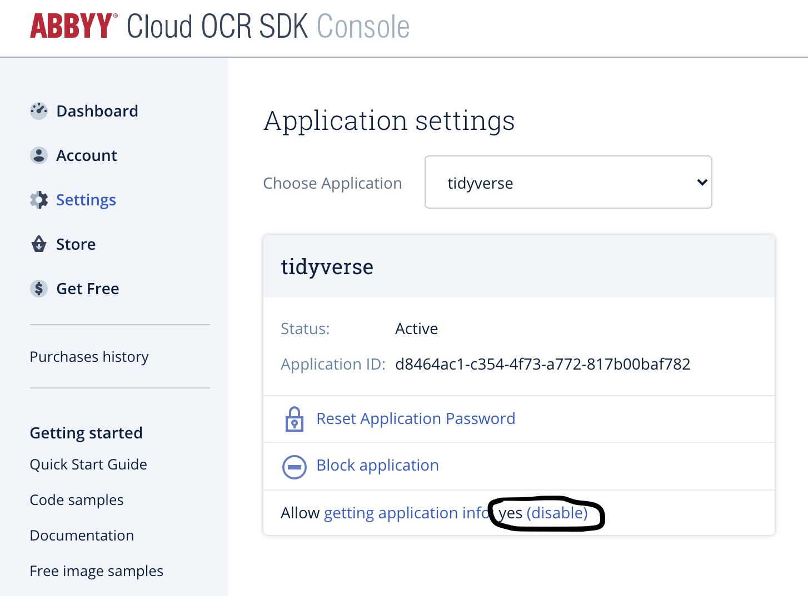

```{r setup, include=FALSE}
knitr::opts_chunk$set(echo = TRUE, message=FALSE, warning=FALSE,
                      comment="", digits = 3, tidy = FALSE, prompt = FALSE, fig.align = 'center')

```


# 애비 클라우드 {#abbyy-cloud}

1. [ABBYY Cloud OCR SDK](https://www.ocrsdk.com/)에 접속하여 계정을 생성한다.
1. 가입이 완료되면 `Application ID`와 비번을 등록한 전자우편을 통해 확인할 수 있다.

# `abbyyR` 설치 {#install-abbyyR}

[`abbyyR`](https://github.com/soodoku/abbyyR) 웹사이트를 방문하면 `abbyyR` R 팩키지를 다운로드 받아 사용할 수 있다. 

R 클라이언트 설정이 마무리되면 [ABBYY Cloud OCR SDK](https://www.ocrsdk.com/)를 사용하기 위해서 ABBYY 클라우드를 방문하여 APP_ID, APP_PW 를 발급받는다.

1. [ABBYY Cloud OCR SDK](https://www.ocrsdk.com/)에서 발급받은 APP_ID, APP_PW를 `usethis::edit_r_environ()` 명령어를 통해 저장시킨다.
    - `ABBYY_ID="d8464ac1-xxxxxxxxxxxxxxxxxx"`
    - `ABBYY_PW="DLuh1Zxxxxxxxxxxxxxxxxxxxxx"`
1. `.Renviron` 파일에 저장시킨 APP_ID, APP_PW를 `Sys.getenv()` 함수로 불러와서 `setapp()` 함수로 ABBYY CLOUD에 인증하도록 설정한다.
1. `getAppInfo()` 함수를 사용해서 ABBYY CLOUD 관련 정보를 확인한다.
    - 특히 `Allow getting application info` 활성화를 잊지 않는다.
1.`getAppInfo()` 함수를 호출하여 "Hello World"를 찍는다.

{#id. class width="70%"}

```{r install-abbyyR, error=TRUE}
# devtools::install_github("soodoku/abbyyR", build_vignettes = TRUE)
library(abbyyR)
setapp(c(Sys.getenv("ABBYY_ID"), Sys.getenv("ABBYY_PW")))

getAppInfo()
```


# `ABBYY` 클라우드 시험가동 {#extract-text-from-image-dry-run}

`ABBYY` 클라우드 로그인 작업을 수행하게 되면 각 국가별 대표 언어로 기술된 텍스트 문서가 포함되어 있다. 이를 다운로드 받아 `ABBYY` 클라우드를 통해 OCR작업을 수행해 보자. 다운로드 받은 이미지 압축을 풀게 되면 `Korean.png` 파일이 된다. 이를 `ABBYY` OCR 작업을 수행한 후에 떨어진 결과값을 텍스트로 저장한다. 작업흐름은 다음과 같다.


## 대상 텍스트 이미지 {#Korean-ocr-text}

`Korean.jpg` 파일을 확인할 수 있도록 `magick` 팩키지를 사용해서 R로 불러읽어 들인다.

```{r ocr-text-korean}
library(tidyverse)
library(magick)

korean_doc <- image_read("fig/Korean.jpg")

korean_doc %>% 
  image_resize("500x")
```

## OCR 작업 {#Korean-ocr-text-process}

이미지를 `processImage()` 함수에 넣어 실어 보내고, 언어를 한국어 `language = "Korean"`로 지정하여 텍스트를 추출한다. 조금 당황스러울 수도 있겠지만, 개념이 ABBYY 클라우드에 OCR 작업을 보내게 되면 `taskID` 부여되고 이를 추적하여 결과를 얻게 되는 방식으로 구현되어 있다. 따라서, `Status of the task:  Completed`가 된 경우 작업 결과를 확인할 수 있다.

```{r ocr-text-korean-process}
ocr_task <- processImage(file_path = "fig/Korean.jpg", language = "Korean", exportFormat = "txtUnstructured")
Sys.sleep(5) ## 클라우드 처리 시간 보장 5초.
getTaskStatus(taskId=ocr_task$id) 
```

## 파일 저장 {#Korean-ocr-text-process-save}

`Status of the task:  Completed` 완료를 확인 후에 결과를 파일로 저장시킨다.

```{r ocr-text-korean-process-save}
ocr_result <- getResults(output = "data/", save_to_file = TRUE)

ocr_result %>% 
  select(id, registrationTime, status, local_file_path) %>% 
  filter(id == ocr_task$id)
```

`ocr_task$id`을 키값으로 삼아 OCR된 문서에서 텍스트를 추출해보자. 이를 위해 먼저 파일이 위치한 경로와 파일명을 확인하고 나서 `read_lines()`함수로 텍스트를 불러읽어온다.

```{r ocr-text-korean-process-save-display}
ocred_path_filename <- glue::glue("data/{ocr_task$id}")

ocr_text <- read_lines(ocred_path_filename)
ocr_text
```

# 명함 텍스트 추출 {#extract-text-from-image}

ABBYY 클라우드 설정이 제대로 되었는지 확인했고, 다음으로 `Korean.png` 파일을 사용해서 텍스트를 추출하는 작업을 완료했다면 다음으로 특정문서(예를 들어, 전자세금계산서, 영수증, 사업자등록증, 납부고지서 등)를 OCR 하기 위해서 ABBYY 클라우드, 엄밀히 말하면 ABBYY 제품(FineReader)에서 제공하는 기능을 호출하여 사용한다.


## OCR 대상 명함 이미지 {#biz-card-from-image}

[구글 이미지 검색](http://images.google.com/)에서 얻은 명함 이미지를 한장 다운로드 받아 이를 명함 인식 대상으로 작업한다.

```{r biz-card-image}
library(tidyverse)
library(magick)

biz_card <- image_read("fig/biz_card.png")

biz_card %>% 
  image_resize("300x")
```

## 명함 OCR 작업 {#biz-card-from-image-ocr}

`processBusinessCard()` 함수를 호출하여 명함 인식에 도전한다. 

```{r biz-card-ocr}
biz_card_ocr <- processBusinessCard(file_path = "fig/biz_card.png", language = "Korean", exportFormat = "vCard")
Sys.sleep(5) ## 클라우드 처리 시간 보장 5초.
getTaskStatus(taskId=biz_card_ocr$id) 
```

명함인식 작업결과를 로컬 컴퓨터 파일로 저장시킨다.

```{r biz-card-korean-process-save}
ocr_result <- getResults(output = "data/", save_to_file = TRUE)

Sys.sleep(5)
## 다운로드 받은 명함 OCR 파일 --> 확장자 부여
vCard_name <- glue::glue("data/{biz_card_ocr$id}")
system(glue::glue("cp {vCard_name} data/contact_kim.vcf"), intern = TRUE)

ocr_result %>% 
  select(id, registrationTime, status, local_file_path) %>% 
  filter(id == biz_card_ocr$id)

```

`ABBYY`에서 인식한 결과를 파일로 저장시켰는데 후속 작업을 위해서 R로 불러와서 인식된 내용을 확인한다.

```{r biz-card-korean-process-save-display}
biz_card_path_filename <- glue::glue("data/{biz_card_ocr$id}")

biz_card_ocr_text <- read_lines(biz_card_path_filename)
biz_card_ocr_text
```

## R 명함 {#pagedown-business-cards}

`pagedown` 팩키지 `pagedown_business_card_template()` 함수를 사용해서 명함을 생성시킬 수 있다.

```{r create-pagedown-business-cards}
contact_vcf <- read_lines("data/contact_kim.vcf")

# 주요 정보 추출
phone <- str_extract(contact_vcf, "(?<=TEL;CHARSET=utf-8;WORK;VOICE:).*") %>% 
  na.omit() %>% .[1]
title <- str_extract(contact_vcf, "(?<=TITLE;CHARSET=utf-8:).*") %>% na.omit()
name <- str_extract(contact_vcf, "(?<=FN;CHARSET=utf-8:).*") %>% na.omit()
address <- str_extract(contact_vcf, "(?<=ADR;CHARSET=utf-8;WORK:).*") %>% 
  na.omit() %>% .[1]

## 명함생성을 위한 사전 작업
library(ymlthis)

biz_card_yml <- pagedown_business_card_template(
  title = "&nbsp;",
  name = name,
  phone = phone,
  email = "jane.doe@example.com",
  url = "www.example.com",
  address = address,
  logo = "../fig/biz_card_logo.png",
  .repeat = 1
)

biz_card_yml %>% 
  write_lines("data/biz_card.Rmd")
```

OCR에서 추출한 텍스트 정보를 사용해서 R마크다운 명함으로 다시 제작한다.

```{r create-business-card-markdownfile}
biz_card_yml %>% 
  yml_output(pagedown::business_card()) %>% 
  yaml::write_yaml("data/biz_card.Rmd")

yml_file_fixed <- read_lines("data/biz_card.Rmd") 

yml_file_fixed[length(yml_file_fixed)+1] <- NA
yml_file_fixed <- lag(yml_file_fixed, default = "---")
yml_file_fixed[length(yml_file_fixed)+1] <- "---"

yml_file_fixed %>% 
  write_lines("data/biz_card.Rmd")

yml_file_fixed
```

## R 명함 {#pagedown-business-cards}

이제 앞서 작성한 `pagedown` 팩키지 명함을 `rmarkdown` 팩키지 `render()`함수를 사용해서 HTML 명함을 생성시킨다.

```{r create-pagedown-buisness-card, eval = TRUE }
rmarkdown::render("data/biz_card.Rmd")
htmltools::includeHTML("data/biz_card.html")
```

