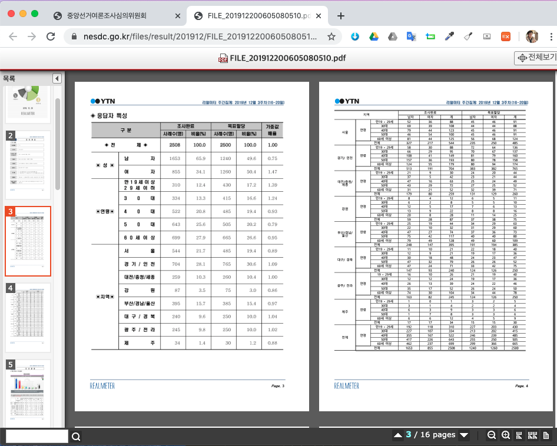

```{r, include=FALSE}
knitr::opts_chunk$set(echo = TRUE, warning=FALSE, message=FALSE,
                    comment="", digits = 3, tidy = FALSE, prompt = FALSE, fig.align = 'center')

library(tidyverse)
```

# 중앙선거 여론조사 심의위원회 {#pdf-nesdc-portal}

[중앙선거 여론조사 심의위원회](https://www.nesdc.go.kr/portal/main.do) 포탈에서 여론조사결과 현황을 파악할 수 있다. 문제는 PDF 파일을 이미지로 찍어 HTML 웹으로 변환시켜 공개하고 있다는 사실이다.

{#id .class width="100%"}

# 데이터 가져오기 [^webshot-vignette] {#pdf-nesdc-portal-ingest}

[^webshot-vignette]: [`webshot`, "An Introduction to the webshot Package
"](https://wch.github.io/webshot/articles/intro.html)

다음 여론조사 결과를 데이터로 삼아 PDF 이미지에서 표를 식별하고 데이터프레임으로 변환시키는 방법을 살펴보자. 

- 등록번호: 6269	
- 조사기관명: (주)리얼미터	
- 의뢰자: YTN	
- 여론조사 명칭: 전국 정기(정례)조사 정당지지도 12월 3주차 주간집계	
- 등록일: 2019-12-20
- 지역: 전국

## 웹사이트 특정 영역 긁어오기 {#scrap-website}

[여론조사결과 등록현황 상세보기](https://www.nesdc.go.kr/portal/bbs/B0000005/view.do?nttId=6637&menuNo=200467&searchTime=&sdate=&edate=&pdate=&pollGubuncd=&searchCnd=&searchWrd=&pageIndex=1) 웹사이트에 올라온 내용을 `webshot`으로 떠서 이를 이미지로 저장한다.

이를 위해서 먼저 웹사이트에서 마우스 우클릭을 하고 "검사"를 열어 추출하고자 하는 영역의 `selector` 위치를 특정시킨다.  

{#id .class width="77%"}

`webshot` 팩키지를 가져와서 `selector`에 복사한 특정 영역을 붙여넣는다. 
그리고 나서 이를 나중에 사용할 것이라... `fig/nesdc.png` `fig` 디렉토리 `nesdc.png` 파일로 저장시킨다.

```{r ingest-nesdc-selector}
library(webshot)

nesdc_overview_url <- "https://www.nesdc.go.kr/portal/bbs/B0000005/view.do?nttId=6637&menuNo=200467&searchTime=&sdate=&edate=&pdate=&pollGubuncd=&searchCnd=&searchWrd=&pageIndex=1"

webshot(nesdc_overview_url, "fig/nesdc.png", selector = 'body > section > div > div > div.content > table:nth-child(5)', delay=0.5)

# nesdc_url <- "https://www.nesdc.go.kr/files/result/201912/FILE_201912200605080510.pdf.htm"
# Might need a longer delay for all assets to display
# webshot(URL, delay = 0.5)
```

## 두번째 사례 {#html-code}

HTML 코드가 예술이다... 코드 리뷰는 어디 갔는지 ... 누군가 코드 리뷰하고 검수를 해야 되는게 아닌지... 

- `selector` HTML 내부 코드를 보자.
    - 표본의 크기: `body > section > div > div > div.content > table.table.temp.view`
    - 조사방법: 
        - 조사방법 1: `body > section > div > div > div.content > div.tapview > div.set1`
        - 조사방법 2: `#ADDtable1`
        - 조사방법 3: `#ADDtable2`
    - 여론조사결과: `body > section > div > div > div.content > table:nth-child(12)`    

```{r ingest-nesdc-webshot-selector2}
webshot(nesdc_overview_url, selector = '#ADDtable1', delay=0.5)
```


